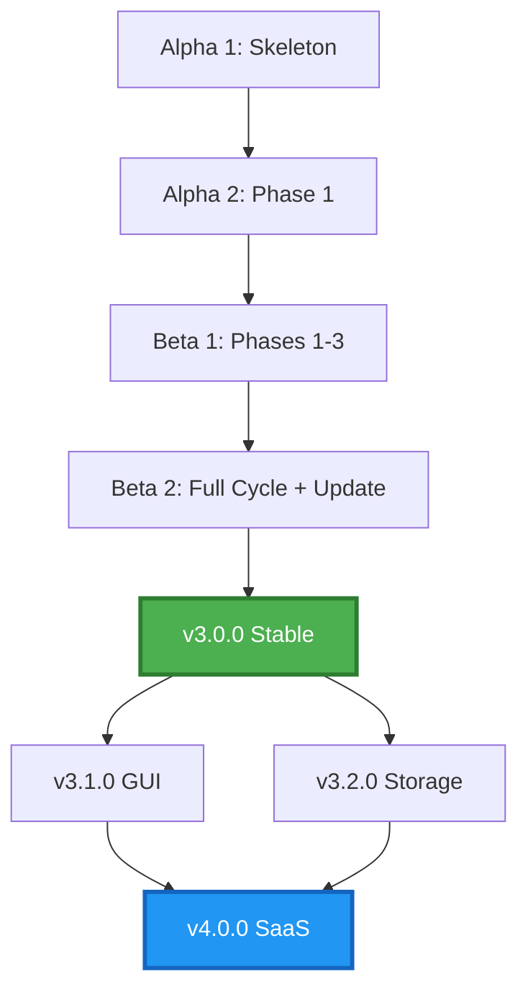

# Roadmap

> Visual timeline from alpha to v4.0 SaaS. Milestones are calendar weeks.

---

## Table of Contents

- [Overview](#overview)
- [Milestone Details](#milestone-details)
- [Dependency Graph](#dependency-graph)
- [Risk-Adjusted Timeline](#risk-adjusted-timeline)

---

## Overview

```mermaid
gantt
    title HFB Development Timeline (Weeks)
    dateFormat X
    axisFormat %s
    section Foundation
    Alpha 1: 0, 2
    Alpha 2: 2, 4
    section Core
    Beta 1: 4, 6
    Beta 2: 6, 8
    section Stable
    v3.0.0 Stable: 8, 10
    section Extensions
    v3.1.0 GUI: 10, 14
    v3.2.0 Storage: 14, 18
    section SaaS
    v4.0.0 SaaS: 18, 24
```

---

## Milestone Details

### v3.0.0-alpha.1 — Skeleton + Menu (Weeks 1-2)

**Theme**: "It compiles and shows a menu"

- [ ] Cargo workspace with feature flags (tui, gui, storage, cloud)
- [ ] ratatui 0.29 loop with MPSC channel (DT-01)
- [ ] Menu screen with keyboard navigation
- [ ] CI on Linux with mockall tests (DT-09)
- [ ] Trait definitions: SystemInfoProvider, RegistryProvider, ServiceProvider
- [ ] Exit cleanly without panics

**Deliverable**: Binary runs, navigates menu, exits cleanly. Tests pass on Linux CI.

---

### v3.0.0-alpha.2 — Phase 1 Functional (Weeks 3-4)

**Theme**: "We can audit a machine"

- [ ] WMI implementation for hardware collection
- [ ] Registry fallback when WMI restricted
- [ ] Software enumeration (Registry + optional Win32)
- [ ] Windows Update Agent query
- [ ] Service enumeration with third-party flag
- [ ] Registry Run keys collection
- [ ] Environment variables collection
- [ ] State JSON save with schema_version: 1
- [ ] machine_id persistent file (DT-10)
- [ ] HTML report generation

**Deliverable**: Full audit completes, JSON saved, HTML report generated.

---

### v3.0.0-beta.1 — Phases 1-3 + Headless (Weeks 5-6)

**Theme**: "Clean without looking"

- [ ] Temporary file cleanup
- [ ] Browser cache cleanup
- [ ] Windows Update installation
- [ ] Service optimization (disable unnecessary)
- [ ] Registry orphan cleanup
- [ ] System restore point creation
- [ ] Headless mode: --auto-phase 0 --format=json
- [ ] Standardized exit codes (DT-12)
- [ ] JSON Lines logging (DT-13)
- [ ] Dual-mode tracing subscriber

**Deliverable**: hfb --auto-phase 0 --format=json runs end-to-end on test fleet.

---

### v3.0.0-beta.2 — Full Cycle 0-5 + Auto-Update (Weeks 7-8)

**Theme**: "Reboot and forget"

- [ ] Task Scheduler integration for Phase 5
- [ ] SFC / DISM / CHKDSK execution
- [ ] Second reboot scheduling on SFC failure
- [ ] Corrupted state detection and retry logic
- [ ] Auto-update check on startup
- [ ] Ed25519 signature verification (DT-11)
- [ ] Download, verify, extract update archive
- [ ] MoveFileEx DELAY_UNTIL_REBOOT for replacement

**Deliverable**: Real reboot test passes; Phase 5 auto-executes; update flow verified.

---

### v3.0.0 — Stable TUI Release (Weeks 9-10)

**Theme**: "Production-ready"

- [ ] Code signing certificate applied
- [ ] Microsoft SmartScreen reputation submission
- [ ] Installer (Inno Setup or MSI)
- [ ] Complete documentation (this repo)
- [ ] Benchmark suite in benches/
- [ ] Security audit (dependency scan + fuzzing)
- [ ] Release notes and changelog

**Deliverable**: Signed installer, AV-clean, documented, benchmarked.

---

### v3.1.0 — GUI iced (Weeks 11-14)

**Theme**: "Click, not type"

- [ ] Iced 0.13 integration (feature flag gui)
- [ ] Dashboard cards (system status)
- [ ] Wizard flow for maintenance
- [ ] Progress bars with ETA
- [ ] Windows Toast notifications
- [ ] PDF report export
- [ ] Two binaries: hfb (TUI) and hfb-gui

**Deliverable**: GUI binary runs on Windows 10/11 with full feature parity.

---

### v3.2.0 — Pro Storage (Weeks 15-18)

**Theme**: "Find every duplicate"

- [ ] Blake3 incremental file indexing
- [ ] SQLite backend for index (DT-03)
- [ ] Duplicate detection by hash + size
- [ ] PhotoRec-style file recovery
- [ ] DoD 5220.22-M secure wipe
- [ ] Resume interrupted scans (checkpoint every 1000 files)

**Deliverable**: Storage module handles 1M+ files with resume capability.

---

### v4.0.0 — SaaS Complete (Weeks 19-24)

**Theme**: "See the whole fleet"

- [ ] Next.js 14 portal (App Router)
- [ ] Axum API with OpenAPI (utoipa)
- [ ] PostgreSQL for report storage
- [ ] Redis for caching and rate limiting
- [ ] JWT auth + API keys for RMMs
- [ ] WebSocket real-time alerts
- [ ] Fleet dashboard with Recharts
- [ ] Webhook and email alerts
- [ ] Licensing and subscription management

**Deliverable**: SaaS portal live with multi-tenant fleet management.

---

## Dependency Graph

---

## Risk-Adjusted Timeline

| Risk | Impact | Mitigation | Buffer |
|------|--------|------------|--------|
| R03: AV false positive | High | Code signing in Week 9 (not E6) | +1 week |
| R10: iced_aw incompatible | Medium | Pin iced version; use pure iced | +0 weeks |
| R12: CI Linux doesn't test Windows | Medium | Weekly Windows runner | +0 weeks |
| R06: Blake3 scan interrupted | Low | SQLite resume + lock file | +0 weeks |

**Expected completion**: v3.0.0 by Week 11 (with buffer), v4.0.0 by Week 26.

---

*Last updated: 2026-06-20 | Document version: 1.0*
