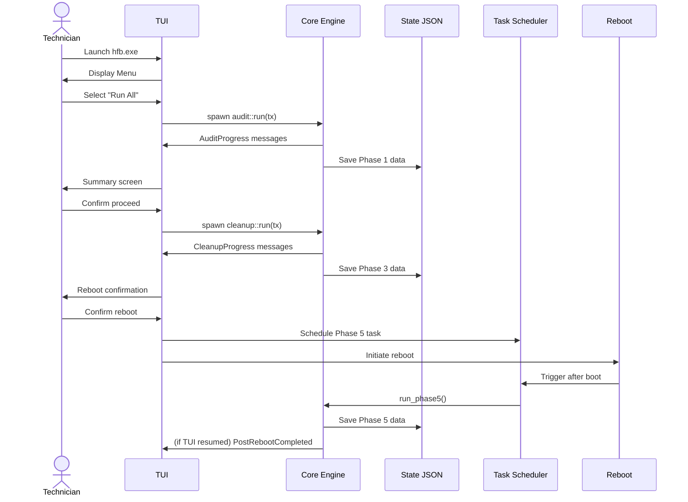

# Use Cases

> Complete actor-goal mapping with acceptance criteria and failure scenarios.

---

## Table of Contents

- [UC-01: Full Maintenance Cycle](#uc-01-full-maintenance-cycle)
- [UC-02: Audit Only](#uc-02-audit-only)
- [UC-03: Post-Reboot Resume](#uc-03-post-reboot-resume)
- [UC-04: Generate Report from Existing State](#uc-04-generate-report-from-existing-state)
- [UC-05: Simulation Mode](#uc-05-simulation-mode)
- [UC-06: Headless MSP Deployment](#uc-06-headless-msp-deployment)
- [UC-07: Real-Time Log Monitoring](#uc-07-real-time-log-monitoring)
- [UC-08: One-Click GUI (Future)](#uc-08-one-click-gui-future)

---

## UC-01: Full Maintenance Cycle

**Actor**: Technician of IT  
**Goal**: Execute complete maintenance (Phases 1 to 5) with minimal interaction  
**Priority**: Critical

### Main Flow


### Acceptance Criteria
- [ ] Phases execute sequentially 1 to 2 to 3 to 4 to 5
- [ ] HTML and TXT reports generated in C:\ManutencaoWindows\Relatorios\
- [ ] Reboot scheduled only after user confirmation or --auto-phase flag
- [ ] Phase 5 auto-executes via Task Scheduler without user login
- [ ] State JSON survives unexpected termination at any sub-phase

---

## UC-02: Audit Only

**Actor**: Technician of IT  
**Goal**: Collect system inventory without making changes  
**Priority**: High

### Main Flow
1. Menu -> "Phase 1 Only"
2. Collect: hardware, software, updates, services, registry, environment
3. Save estado_manutencao.json with schema_version: 1
4. Generate report from collected data

### Acceptance Criteria
- [ ] No system modifications (read-only operations)
- [ ] WMI fallback to registry if WMI restricted by GPO
- [ ] JSON validates against schema v1
- [ ] Report generated in < 30s after collection completes

---

## UC-03: Post-Reboot Resume

**Actor**: System / User  
**Goal**: Complete Phase 5 after automatic reboot  
**Priority**: Critical

### Failure Scenarios

| Scenario | Detection | Behavior | User Message |
|----------|-----------|----------|-------------|
| **Corrupted/missing JSON** | load_state() returns Err | Abort; log error; do NOT remove scheduled task | "State missing or corrupted. Re-run Phase 1." |
| **SFC finds irreparable errors** | ExitCode != 0 | Log result; do NOT remove task; schedule second reboot if needed | "SFC requires additional reboot. Scheduling automatically." |
| **User cancelled scheduled task** | Next run detects task missing | Prompt: continue Phase 5 or abort | "Scheduled task removed. Run Phase 5 now? [Y/N]" |

```mermaid
stateDiagram-v2
    [*] --> CheckState
    CheckState --> Corrupted : JSON invalid
    Corrupted --> [*] : Abort, keep task
    CheckState --> AlreadyDone : Phase 5 in executed[]
    AlreadyDone --> [*] : Remove task, exit
    CheckState --> RunSFC : State valid
    RunSFC --> SFC_OK : ExitCode 0
    SFC_OK --> RunDISM
    RunDISM --> DISM_OK --> RunCHKDSK --> Success
    RunSFC --> SFC_Fail : ExitCode != 0
    SFC_Fail --> NeedsReboot : needs_second_reboot
    NeedsReboot --> [*] : Schedule reboot, keep task
    SFC_Fail --> Fatal : !needs_second_reboot
    Fatal --> [*] : Log, keep task for manual retry
    Success --> [*] : Remove task, save state
```

---

## UC-04: Generate Report from Existing State

**Actor**: Technician of IT  
**Goal**: Create report without re-executing maintenance  
**Priority**: Medium

### Acceptance Criteria
- [ ] Reads existing estado_manutencao.json (any version, auto-migrated)
- [ ] Supports HTML, TXT, and JSON output formats
- [ ] No network or WMI calls required
- [ ] Fails gracefully if state file missing

---

## UC-05: Simulation Mode

**Actor**: Technician of IT  
**Goal**: Preview what would be done without executing  
**Priority**: Medium

### Main Flow
```bash
$ hfb --what-if
```

### Acceptance Criteria
- [ ] No filesystem/registry/service modifications
- [ ] All operations prefixed with [SIMULATION] in logs
- [ ] Simulated report shows projected bytes freed, services disabled, updates installed
- [ ] Exit code: 3 (SIMULATION_COMPLETE)

---

## UC-06: Headless MSP Deployment

**Actor**: MSP / Administrator  
**Goal**: Deploy and collect results across fleet without interaction  
**Priority**: High

### Main Flow
```bash
# Deployed via GPO or RMM script
hfb --auto-phase 0 --format=json --output="\\server\share\%COMPUTERNAME%.json"
```

### Acceptance Criteria
- [ ] Zero interactive prompts
- [ ] Structured JSON output parseable by jq/Splunk/Datadog
- [ ] Standardized exit codes (0=success, 1=fatal, 2=warnings, 5=reboot pending)
- [ ] Logs written to C:\ManutencaoWindows\Logs\ in JSON Lines format
- [ ] Task Scheduler creation verified before reporting success

---

## UC-07: Real-Time Log Monitoring

**Actor**: Technician of IT  
**Goal**: Observe progress during long-running operations  
**Priority**: Medium

### Acceptance Criteria
- [ ] Log panel updates without blocking core operations
- [ ] Color coding: Debug(gray), Info(white), Warn(yellow), Error(red), Success(green), Phase(cyan)
- [ ] Auto-scroll with manual pause on scroll-up
- [ ] Timestamp in RFC 3339 with millisecond precision
- [ ] Persisted to hfb_YYYYMMDD_HHMMSS.jsonl

---

## UC-08: One-Click GUI (Future)

**Actor**: End User  
**Goal**: Maintenance with single click and minimal technical knowledge  
**Priority**: Future (v3.1.0+)

### Acceptance Criteria (v3.1.0)
- [ ] Iced-based GUI with wizard flow
- [ ] Progress bars with ETA estimation
- [ ] Windows Toast notification on completion
- [ ] PDF report export
- [ ] No terminal window visible

---

*Last updated: 2026-06-20 | Document version: 1.0*
