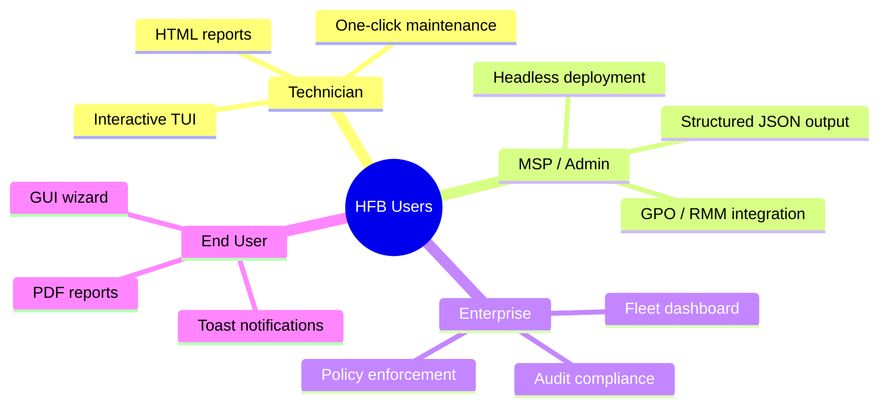

# 🗡️ Highlander Forge Blade

> **Professional Windows Maintenance Engine — Rust-powered, TUI-first, Enterprise-ready**

---

## Table of Contents

- [Vision](#vision)
- [Core Principles](#core-principles)
- [Target Audiences](#target-audiences)
- [Competitive Landscape](#competitive-landscape)
- [Success Metrics](#success-metrics)

---

## Vision

**Highlander Forge Blade (HFB)** is a next-generation Windows maintenance and optimization platform built in Rust. It bridges the gap between ad-hoc PowerShell scripts and bloated, closed-source "PC optimizers" by providing:

- **A deterministic, auditable maintenance pipeline** — 5 phases from audit to post-reboot repair
- **Zero-cost abstractions** — bare-metal performance via Rust's ownership model
- **Dual-mode operation** — interactive TUI for technicians, headless JSON for RMM/MSP integration
- **Cryptographic integrity** — Ed25519-signed auto-updates, AES-256-GCM encrypted state
- **Fleet visibility** — SaaS dashboard for multi-machine management (v4.0+)

> *"There can be only one tool on the technician's USB stick."*

---

## Core Principles

| Principle | Implementation |
|-----------|---------------|
| **Determinism** | Every phase is idempotent, state-versioned, and resumable |
| **Transparency** | All operations logged in structured JSON; `--what-if` simulation mode |
| **Resilience** | Fails gracefully: corrupted state -> retry; missing WMI -> registry fallback |
| **Security** | No secrets in code; Credential Manager for keys; compile-time embedded public keys |
| **Testability** | Traits abstract all Windows-specific code; mocks run on Linux CI |
| **Ergonomics** | TUI with real-time progress, keyboard navigation, and color-coded severity |

---

## Target Audiences

---

## Competitive Landscape

| Tool | Open Source | Structured Output | Resume After Reboot | Crypto-Signed Updates | Rust |
|------|:-----------:|:-----------------:|:-------------------:|:---------------------:|:----:|
| CCleaner | No | No | No | No | No |
| BleachBit | Yes | No | No | No | No |
| TronScript | Yes | No | Partial | No | No |
| **HFB v3.0** | Yes | Yes | Yes | Yes | Yes |

---

## Success Metrics

- **Performance**: Full audit (Phase 1) completes in < 60s on i5-8400 / 8GB RAM
- **Reliability**: 99.5% success rate across 1000+ headless deployments
- **Security**: Zero false-positive AV detections after code signing
- **Adoption**: 100+ stars, 10+ contributors by v3.0 stable

---

*Last updated: 2026-06-20 | Document version: 1.0*
