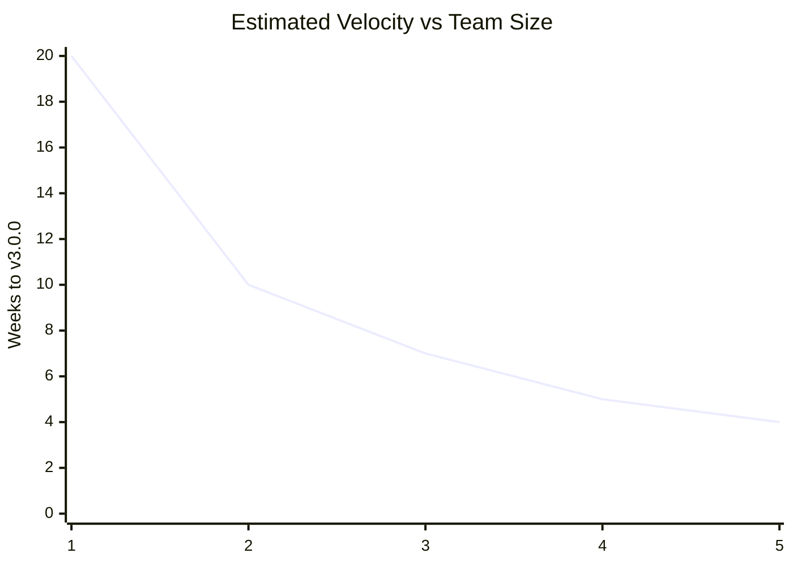

# Function Points Analysis

> Complexity-weighted sizing for v3.0.0 TUI, v3.1.0 GUI, and v4.0.0 vision.

---

## Table of Contents

- [Methodology](#methodology)
- [Core Engine](#core-engine)
- [UI Layer](#ui-layer)
- [Storage & Future](#storage--future)
- [Totals](#totals)
- [Velocity Projection](#velocity-projection)

---

## Methodology

Using IFPUG-like simplified function point counting:

| Complexity | Weight | Criteria |
|------------|--------|----------|
| **Low** | 3.9 PF | Simple I/O, straightforward logic, no external interfaces |
| **Medium** | 6.5 PF | Moderate logic, single external interface, simple calculations |
| **High** | 9.1 PF | Complex algorithms, multiple interfaces, significant data manipulation |

---

## Core Engine

| Module | Function | Type | Complexity | PF |
|--------|----------|------|------------|-----|
| Audit | Hardware collection (CPU, RAM, disk, GPU, temp) | Process | Medium | 6.5 |
| Audit | Software collection (Registry + Win32 optional) | Process | High | 9.1 |
| Audit | Windows Update Agent query | Process | High | 9.1 |
| Audit | Services enumeration (all + third-party) | Process | Medium | 6.5 |
| Audit | Registry Run keys collection | Process | Medium | 6.5 |
| Audit | Environment variables | Process | Low | 3.9 |
| Cleanup | Temporary files removal | Process | Low | 3.9 |
| Cleanup | Browser cache cleanup | Process | Medium | 6.5 |
| Cleanup | Windows Update installation | Process | High | 9.1 |
| Cleanup | Service optimization | Process | Medium | 6.5 |
| Cleanup | Registry orphan cleanup | Process | Medium | 6.5 |
| Repair | SFC / DISM / CHKDSK execution | Process | High | 9.1 |
| System | Restore point creation | Process | Low | 3.9 |
| System | Task Scheduler management | Process | Medium | 6.5 |
| State | JSON persistence with versioning | Interface | Medium | 6.5 |
| Report | HTML report generation | Output | High | 9.1 |
| Report | Text report generation | Output | Low | 3.9 |
| **Core Engine Subtotal** | | | | **113.1** |

---

## UI Layer

### TUI (v3.0.0)

| Module | Function | Type | Complexity | PF |
|--------|----------|------|------------|-----|
| TUI | Menu screen | Interface | Low | 3.9 |
| TUI | Progress gauge | Interface | Low | 3.9 |
| TUI | Real-time log panel | Interface | Medium | 6.5 |
| TUI | Summary screen | Interface | Low | 3.9 |
| TUI | Reboot confirmation | Interface | Low | 3.9 |
| TUI | Report generation screen | Interface | Low | 3.9 |
| TUI | Keyboard navigation | Interface | Low | 3.9 |
| **TUI Subtotal** | | | | **29.9** |

### GUI (v3.1.0)

| Module | Function | Type | Complexity | PF |
|--------|----------|------|------------|-----|
| GUI | Main window | Interface | Medium | 6.5 |
| GUI | Dashboard cards | Interface | Medium | 6.5 |
| GUI | Usage charts | Output | High | 9.1 |
| GUI | Wizard flow | Interface | High | 9.1 |
| GUI | Toast notifications | Interface | Low | 3.9 |
| GUI | PDF export | Output | Medium | 6.5 |
| **GUI Subtotal** | | | | **41.6** |

---

## Storage & Future

| Module | Function | Type | Complexity | PF |
|--------|----------|------|------------|-----|
| Storage | Blake3 file indexing | Process | High | 9.1 |
| Storage | Duplicate detection | Process | High | 9.1 |
| Storage | PhotoRec-style recovery | Process | High | 9.1 |
| Storage | DoD 5220.22-M wipe | Process | Medium | 6.5 |
| SaaS | Report upload API | Interface | Medium | 6.5 |
| SaaS | Fleet dashboard | Interface | High | 9.1 |
| SaaS | Webhook/email alerts | Interface | Medium | 6.5 |
| **Future Subtotal** | | | | **55.9** |

---

## Totals

| Version | Scope | PF | Est. SLOC (Rust) | Est. Person-Weeks |
|---------|-------|-----|-----------------|-------------------|
| **v3.0.0 TUI** | Core + TUI | **143.0** | ~7,150 | 8-10 |
| **v3.0.0+ GUI** | Core + TUI + GUI | **184.6** | ~9,230 | 12-14 |
| **v4.0.0 Vision** | Full stack | **240.5** | ~12,025 | 20-24 |

> SLOC estimate: 50 PF per SLOC (Rust is expressive)
> Person-weeks: 15-20 PF per week (experienced Rust team)

---

## Velocity Projection

### Assumptions

- 1 senior Rust developer = 1.0 FTE
- Communication overhead: +15% per additional developer
- Context switching: -10% for solo developer
- Testing overhead: 30% of coding time
- Documentation: 15% of total time

---

*Last updated: 2026-06-20 | Document version: 1.0*
