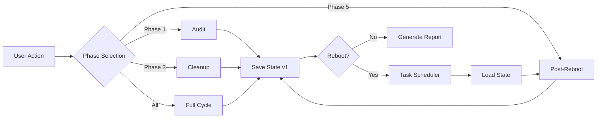
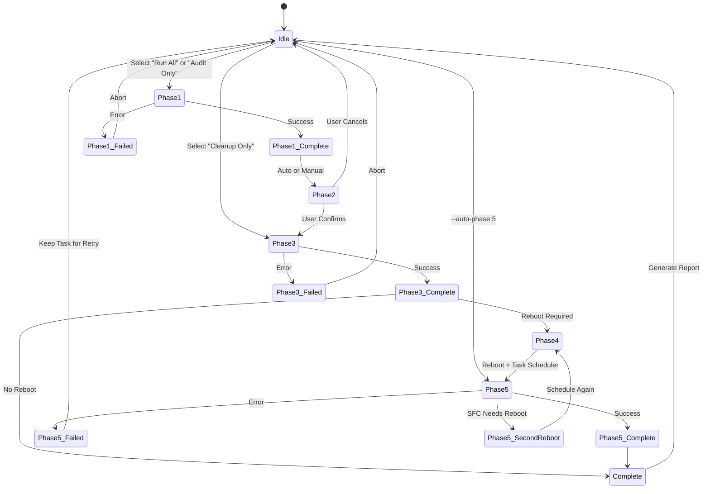

# State Machine

> How HFB manages execution state across phases and reboots.

---

## Table of Contents

- [State Overview](#state-overview)
- [Phase State Diagram](#phase-state-diagram)
- [State File Schema](#state-file-schema)
- [Migration Strategy](#migration-strategy)
- [Persistence Guarantees](#persistence-guarantees)
- [Recovery Scenarios](#recovery-scenarios)

---

## State Overview

HFB maintains state in C:\ManutencaoWindows\estado_manutencao.json. This file:

- Survives unexpected termination (power loss, crash, kill -9)
- Is versioned for forward compatibility
- Can be encrypted with AES-256-GCM
- Is separate from machine_id (which survives state deletion)



---

## Phase State Diagram



---

## State File Schema

### Current Version: v1

```json
{
  "schema_version": 1,
  "created_at": "2026-06-20T03:33:20Z",
  "updated_at": "2026-06-20T04:15:42Z",
  "machine_id": "a1b2c3d4-e5f6-7890-abcd-ef1234567890",
  "app_version": "3.0.0-alpha.1",
  "phases": {
    "phase1": {
      "hardware": {
        "cpu": { "name": "Intel i7-9700K", "cores": 8, "threads": 8, "max_speed_mhz": 4900 },
        "memory": { "total_bytes": 17179869184, "modules": [...] },
        "disks": [...],
        "gpu": [...],
        "motherboard": { ... },
        "temperatures": [...]
      },
      "software": { "programs": [...], "count": 142 },
      "updates": { "pending": 5, "history": [...] },
      "services": { "total": 187, "third_party": 12 },
      "registry": { "run_keys": [...] },
      "environment": { "system": {...}, "user": {...} }
    },
    "phase2": { "user_confirmed": true, "timestamp": "2026-06-20T03:35:00Z" },
    "phase3": {
      "bytes_freed": 2147483648,
      "services_disabled": ["Fax", "MapsBroker"],
      "registry_keys_removed": 3,
      "updates_installed": ["KB1234567"]
    },
    "phase4": { "reboot_scheduled": true, "task_name": "HFB_PostReboot", "scheduled_at": "2026-06-20T03:36:00Z" },
    "phase5": {
      "sfc_result": "ExitCode: 0",
      "dism_result": "ExitCode: 0",
      "chkdsk_results": ["C: - ExitCode: 0"]
    },
    "executed": ["1", "2", "3", "4", "5"]
  },
  "report": {
    "html_path": "C:\\ManutencaoWindows\\Relatorios\\Relatorio_20260620_041542\\relatorio.html",
    "txt_path": "C:\\ManutencaoWindows\\Relatorios\\Relatorio_20260620_041542\\relatorio.txt"
  }
}
```

---

## Migration Strategy

### Version Detection

```rust
pub fn load_state(path: &Path) -> Result<StateFile, StateError> {
    let content = std::fs::read_to_string(path)?;
    let raw: serde_json::Value = serde_json::from_str(&content)?;

    let version = raw.get("schema_version")
        .and_then(|v| v.as_u64())
        .unwrap_or(0) as u32;

    match version {
        0 => migrate_v0_to_v1(raw),
        1 => serde_json::from_value(raw).map_err(StateError::Parse),
        _ => Err(StateError::UnsupportedVersion(version)),
    }
}
```

### v0 to v1 Migration

```rust
fn migrate_v0_to_v1(mut raw: serde_json::Value) -> Result<StateFile, StateError> {
    raw["schema_version"] = json!(1);
    raw["machine_id"] = json!(Uuid::new_v4().to_string());
    raw["app_version"] = json!("3.0.0");

    if raw.get("phases").is_none() {
        raw["phases"] = json!({
            "phase1": raw.take("audit"),
            "phase2": raw.take("summary"),
            "phase3": raw.take("cleanup"),
            "phase4": raw.take("reboot"),
            "phase5": raw.take("post_reboot"),
            "executed": raw.get("completed_phases").cloned().unwrap_or(json!([]))
        });
    }

    serde_json::from_value(raw).map_err(StateError::Parse)
}
```

---

## Persistence Guarantees

### Write Strategy

```rust
pub fn save_state_atomic(state: &StateFile, path: &Path) -> Result<(), StateError> {
    let json = serde_json::to_vec_pretty(state)?;

    let temp_path = path.with_extension("tmp");
    std::fs::write(&temp_path, &json)?;

    #[cfg(windows)]
    {
        let file = std::fs::OpenOptions::new().write(true).open(&temp_path)?;
        file.sync_all()?;
    }

    std::fs::rename(&temp_path, path)?;

    let checksum = crc32fast::hash(&json);
    std::fs::write(path.with_extension("crc32"), checksum.to_string())?;

    Ok(())
}
```

### Checkpoint Schedule

| Phase | Checkpoint Trigger | Frequency |
|-------|-----------------|-----------|
| Phase 1 | After each sub-collection (hardware, software, etc.) | 6 checkpoints |
| Phase 3 | After each cleanup operation | 7 checkpoints |
| Phase 5 | After each repair tool (SFC, DISM, CHKDSK) | 3 checkpoints |

---

## Recovery Scenarios

### Scenario 1: Power Loss During Phase 1

State: phase1 partially filled (hardware OK, software OK, updates missing)
Action: On restart, detect incomplete phase1
         Option A: Resume from last checkpoint (re-run updates, services, registry)
         Option B: Discard and re-run full phase1 (safer, default)

### Scenario 2: User Kills Process During Phase 3

State: phase3 partially filled (temp files OK, browser cache OK, updates missing)
Action: On restart, show resume prompt
         [Resume] Continue from Windows Updates installation
         [Restart] Discard phase3 and re-run from beginning
         [Abort] Keep state, return to menu

### Scenario 3: Phase 5 Task Removed by User

State: phase4 completed, phase5 not executed, task missing
Action: On next run (any mode), detect missing task
         Prompt: "Scheduled task removed. Run Phase 5 now? [Y/N]"
         If Y: Execute phase5 immediately
         If N: Mark as aborted, allow manual retry later

### Scenario 4: State File Corrupted

State: JSON invalid or checksum mismatch
Action: Attempt to load backup (estado_manutencao.json.bak)
        If backup valid: restore and continue
        If backup invalid: report error, require re-run Phase 1

---

*Last updated: 2026-06-20 | Document version: 1.0*
