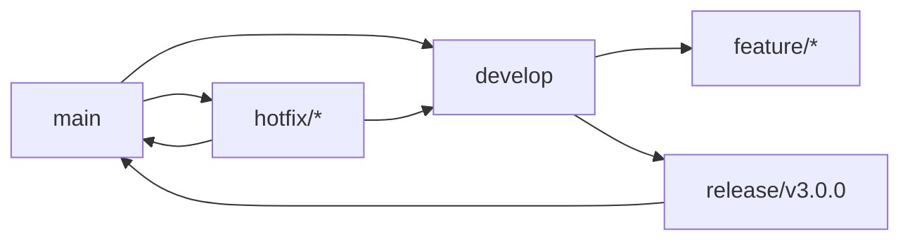
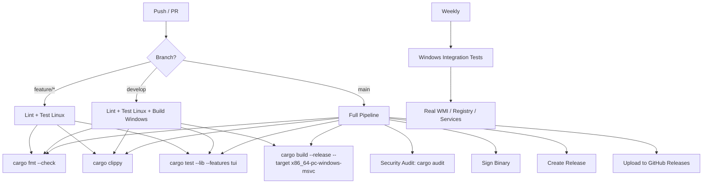

# Development Workflow

> How we build, test, and ship HFB.

---

## Table of Contents

- [Repository Structure](#repository-structure)
- [Branching Strategy](#branching-strategy)
- [CI/CD Pipeline](#cicd-pipeline)
- [Testing Strategy](#testing-strategy)
- [Release Process](#release-process)
- [Local Development](#local-development)

---

## Repository Structure

```
highlander-forge-blade/
├── Cargo.toml              # Workspace root
├── Cargo.lock
├── rust-toolchain.toml     # MSRV: 1.78
├── README.md
├── CHANGELOG.md
├── LICENSE
├── docs/                   # This documentation
├── src/
│   ├── main.rs             # Entry point
│   ├── lib.rs              # Re-exports
│   ├── app/                # Application layer
│   ├── core/               # Business logic
│   ├── ui/                 # UI implementations
│   ├── platform/           # Platform abstractions
│   ├── config.rs
│   ├── logging.rs
│   ├── update.rs
│   └── utils.rs
├── tests/
│   ├── integration/        # Integration tests (mocks)
│   └── fixtures/           # Test data
├── benches/                # Criterion benchmarks
├── assets/                 # Static assets
│   ├── logo.txt
│   ├── icon.ico
│   ├── update_pubkey.bin   # Ed25519 public key
│   └── themes/
└── scripts/
    ├── build-release.ps1   # Windows release build
    └── sign.ps1            # Code signing
```

---

## Branching Strategy



| Branch | Purpose | Protection |
|--------|---------|------------|
| main | Production releases | Require PR + 2 reviews + CI pass |
| develop | Integration branch | Require PR + 1 review + CI pass |
| feature/* | New features | PR to develop |
| release/vX.Y.Z | Release preparation | PR to main |
| hotfix/* | Critical fixes | PR to main and develop |

---

## CI/CD Pipeline



### GitHub Actions Workflows

| Workflow | Trigger | Runner | Duration |
|----------|---------|--------|----------|
| ci.yml | Push/PR | ubuntu-latest | ~3 min |
| build-windows.yml | Push to develop/main | windows-latest | ~8 min |
| integration-windows.yml | Weekly cron | windows-latest | ~20 min |
| security-audit.yml | Daily cron | ubuntu-latest | ~2 min |
| release.yml | Tag push v* | windows-latest | ~15 min |

---

## Testing Strategy

### Test Pyramid

```
        /\
       /  \
      / E2E \      Windows integration (weekly)
     /---------\
    / Integration \  Trait mocks, state migration
   /---------------\
  /    Unit Tests    \  Pure functions, error handling
 /---------------------\
```

### Unit Tests (Linux CI)

```rust
#[cfg(test)]
mod tests {
    use super::*;
    use crate::core::traits::MockSystemInfoProvider;

    #[tokio::test]
    async fn test_audit_with_mocks() {
        let mut mock = MockSystemInfoProvider::new();
        mock.expect_cpu()
            .times(1)
            .returning(|| Ok(CpuInfo::default()));

        let auditor = Auditor::new(&mock, &mock_reg, &mock_svc);
        let (tx, mut rx) = tokio::sync::mpsc::channel(10);

        let result = auditor.run_full(tx).await;
        assert!(result.is_ok());

        let msg = rx.recv().await.unwrap();
        assert!(matches!(msg, AppMsg::AuditProgress { phase: AuditPhase::Hardware, .. }));
    }
}
```

### Integration Tests (Windows, Weekly)

```rust
// tests/integration/audit_flow.rs
#[tokio::test]
#[cfg(windows)]
async fn test_real_wmi_audit() {
    let provider = WmiSystemInfoProvider::new();
    let cpu = provider.cpu().expect("WMI should return CPU info");
    assert!(!cpu.name.is_empty());
}
```

---

## Release Process

### Version Bumping

```bash
# 1. Update version in Cargo.toml
# 2. Update CHANGELOG.md
# 3. Create release branch
git checkout -b release/v3.0.0

# 4. Run full test suite
cargo test --all-features

# 5. Build release binary
cargo build --release

# 6. Tag and push
git tag -a v3.0.0 -m "Release v3.0.0"
git push origin v3.0.0
```

### Automated Release

Tag push triggers release.yml:

```yaml
# .github/workflows/release.yml (excerpt)
- name: Build Release
  run: cargo build --release --target x86_64-pc-windows-msvc

- name: Sign Binary
  run: scripts/sign.ps1 -Binary target/release/hfb.exe

- name: Create Release
  uses: softprops/action-gh-release@v1
  with:
    files: |
      target/release/hfb.exe
      target/release/hfb.pdb
      LICENSE
      CHANGELOG.md
```

---

## Local Development

### Setup

```bash
# Clone
git clone https://github.com/highlanderviralcenter-lab/highlander-forge-blade.git
cd highlander-forge-blade

# Install Rust (MSRV 1.78)
rustup install 1.78
rustup default 1.78

# Install dependencies
cargo fetch

# Build debug
cargo build --features tui

# Run with logs
RUST_LOG=debug cargo run --features tui
```

### Cross-Compilation (Windows from Linux)

```bash
# Install cross-compilation toolchain
rustup target add x86_64-pc-windows-msvc

# Install mingw-w64 (alternative)
sudo apt-get install mingw-w64

# Build with cross
# Note: Windows-specific features will fail to link on Linux
# Use --features tui for UI-only testing
cargo build --target x86_64-pc-windows-gnu --features tui
```

### IDE Setup

**VS Code**:
```json
// .vscode/settings.json
{
  "rust-analyzer.cargo.features": ["tui"],
  "rust-analyzer.check.command": "clippy",
  "editor.formatOnSave": true
}
```

**IntelliJ / RustRover**:
- Enable org.rust.cargo.emulate.terminal for colored test output
- Set Build -> Build Options -> Features to tui

---

*Last updated: 2026-06-20 | Document version: 1.0*
