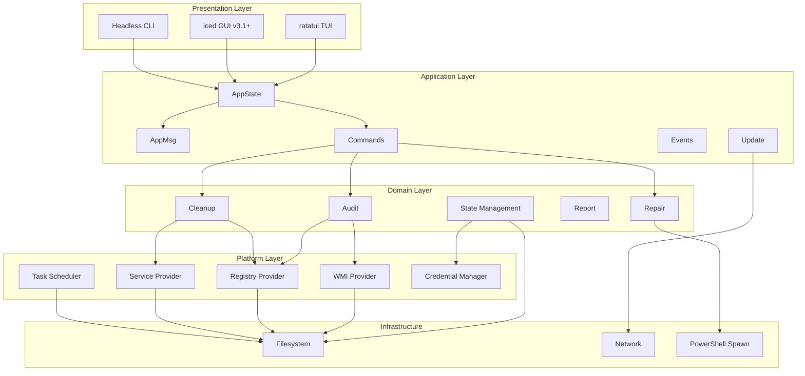
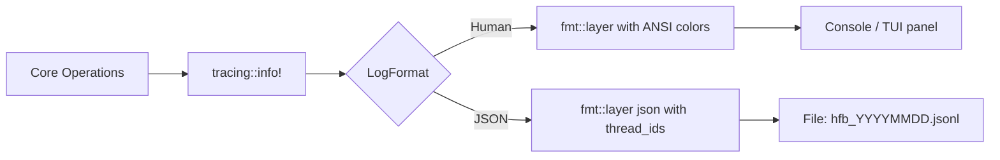

# System Architecture

> Layered architecture with clear separation of concerns.

---

## Table of Contents

- [Layer Diagram](#layer-diagram)
- [Layer Responsibilities](#layer-responsibilities)
- [Dependency Rules](#dependency-rules)
- [Module Map](#module-map)
- [Cross-Cutting Concerns](#cross-cutting-concerns)

---

## Layer Diagram



---

## Layer Responsibilities

### Presentation Layer

| Component | Responsibility | Technology |
|-----------|--------------|------------|
| TUI | Interactive terminal UI, real-time progress, keyboard navigation | ratatui 0.29, crossterm 0.28 |
| GUI | Graphical wizard, dashboard, toast notifications | iced 0.13 |
| CLI | Argument parsing, headless execution, exit codes | clap, std::env |

### Application Layer

| Component | Responsibility |
|-----------|--------------|
| AppState | Central state machine, current view, progress data |
| AppMsg | Event enum (Tick, AuditProgress, LogLine, etc.) |
| Commands | Tokio task spawning, channel management |
| Events | Event bus, cross-module communication |
| Update | Auto-update check, download, verification |

### Domain Layer

| Component | Responsibility |
|-----------|--------------|
| Audit | System information collection (hardware, software, updates, services, registry) |
| Cleanup | File removal, cache clearing, update installation, service optimization |
| Repair | SFC, DISM, CHKDSK execution and result parsing |
| Report | HTML, TXT, JSON report generation from collected data |
| State | Persistence, versioning, encryption, migration |

### Platform Layer

| Component | Responsibility | Windows API |
|-----------|--------------|-------------|
| WmiProvider | Hardware/software queries | Win32_System_Wmi |
| RegistryProvider | Registry read/write/delete | Win32_System_Registry |
| ServiceProvider | Service enumeration, start type, stop | Win32_System_Services |
| TaskScheduler | Create, query, remove scheduled tasks | ITaskService (COM) |
| CredentialManager | Secure key storage | CredWriteW, CredReadW |

### Infrastructure Layer

| Component | Responsibility |
|-----------|--------------|
| Filesystem | Atomic writes, directory traversal, temp file management |
| Network | HTTP client, TLS, download, API communication |
| PowerShell | Spawn powershell.exe for DISM/SFC/CHKDSK |

---

## Dependency Rules

```
Presentation -> Application -> Domain -> Platform -> Infrastructure

Forbidden:
  ❌ Domain -> Presentation
  ❌ Platform -> Application
  ❌ Infrastructure -> Domain (except via traits)
  ❌ TUI -> GUI (or vice versa)

Allowed:
  ✅ Application -> Domain (via traits)
  ✅ Domain -> Platform (via traits)
  ✅ Tests -> Any layer (with mocks)
```

---

## Module Map

```
src/
├── main.rs              # Entry point, feature flags
├── lib.rs               # Re-exports, feature gating
│
├── app/                 # APPLICATION LAYER
│   ├── mod.rs           # AppState, Ui trait, run()
│   ├── state.rs         # StateFile, schema_version, migrate
│   ├── messages.rs       # AppMsg enum (DT-01)
│   ├── update.rs        # fn update(&mut AppState, AppMsg)
│   ├── commands.rs       # Tokio tasks spawning core
│   ├── events.rs        # Event bus
│   ├── crypto.rs        # AES-GCM + Credential Manager (DT-04)
│   ├── machine_id.rs     # Persistent machine_id (DT-10)
│   └── headless.rs      # Headless mode, exit codes (DT-12)
│
├── core/                # DOMAIN LAYER
│   ├── mod.rs
│   ├── error.rs         # CoreError, Result<T, CoreError>
│   ├── traits.rs        # SystemInfoProvider, RegistryProvider, ServiceProvider (DT-09)
│   ├── audit.rs         # Fase 1: WMI, Registry, etc
│   ├── cleanup.rs        # Fase 3: limpeza
│   ├── registry.rs       # Registry manipulation
│   ├── services.rs       # Service control
│   ├── updates.rs        # Windows Update
│   ├── repair.rs         # SFC, DISM, CHKDSK
│   ├── security.rs       # Firewall, privacy
│   ├── system.rs         # Reboot, Task Scheduler
│   ├── storage.rs        # Format-bytes, disk info
│   └── report.rs         # HTML/TXT generation
│
├── ui/                  # PRESENTATION LAYER
│   ├── mod.rs           # Ui trait
│   ├── ratatui/         # TUI implementation
│   │   ├── mod.rs       # Main loop, mpsc channel (DT-01)
│   │   ├── app.rs       # RatatuiApp struct
│   │   ├── views/       # Screens
│   │   └── widgets/     # Reusable components
│   └── iced/            # GUI stub (v3.1+)
│       ├── mod.rs
│       └── README.md
│
├── platform/            # PLATFORM LAYER
│   ├── mod.rs
│   └── windows/         # Windows-specific implementations
│       ├── mod.rs
│       ├── wmi.rs       # WmiSystemInfoProvider
│       ├── registry.rs   # WinRegistryProvider
│       ├── services.rs   # WinServiceProvider
│       ├── com.rs       # COM helpers
│       └── credential.rs # CredentialManager wrapper
│
├── config.rs            # TOML/JSON configuration
├── logging.rs           # Dual-mode tracing (DT-13)
├── update.rs            # Auto-update (DT-07)
└── utils.rs             # Helpers
```

---

## Cross-Cutting Concerns

### Logging



### Error Handling

```rust
// Domain errors
#[derive(thiserror::Error, Debug)]
pub enum CoreError {
    #[error("WMI query failed: {0}")]
    Wmi(#[from] WmiError),
    #[error("Registry access denied: {path}")]
    RegistryAccessDenied { path: String },
    #[error("Service {name} not found")]
    ServiceNotFound { name: String },
    #[error("State corrupted: {0}")]
    StateCorrupted(#[from] StateError),
    #[error("Update signature invalid")]
    InvalidUpdateSignature,
}

// Application errors
#[derive(thiserror::Error, Debug)]
pub enum AppError {
    #[error("UI initialization failed: {0}")]
    UiInit(String),
    #[error("Channel closed")]
    ChannelClosed,
}
```

### Feature Flags

| Feature | Components | Default |
|---------|-----------|---------|
| tui | ratatui, crossterm, unicode-width | Yes |
| gui | iced | No |
| storage | blake3, walkdir, rayon, sqlx | No |
| cloud | reqwest, serde_json | No |
| security-scan | Security audit module | No |

---

*Last updated: 2026-06-20 | Document version: 1.0*
