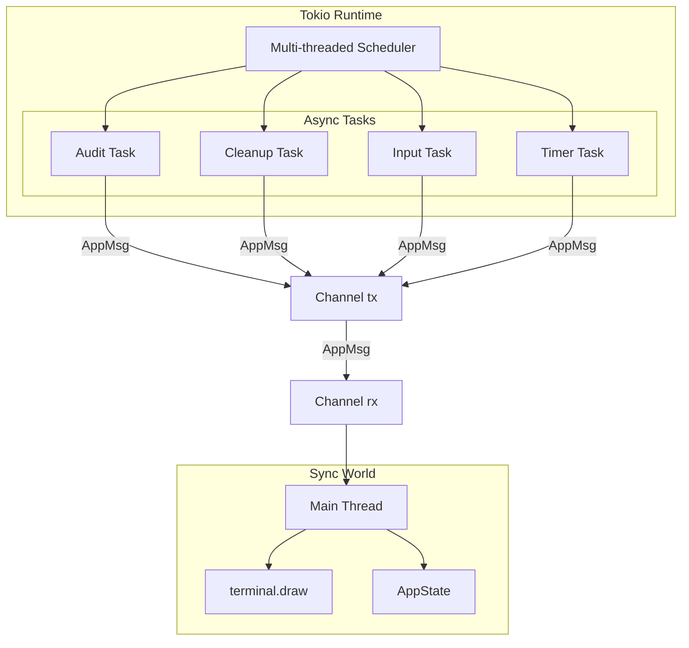
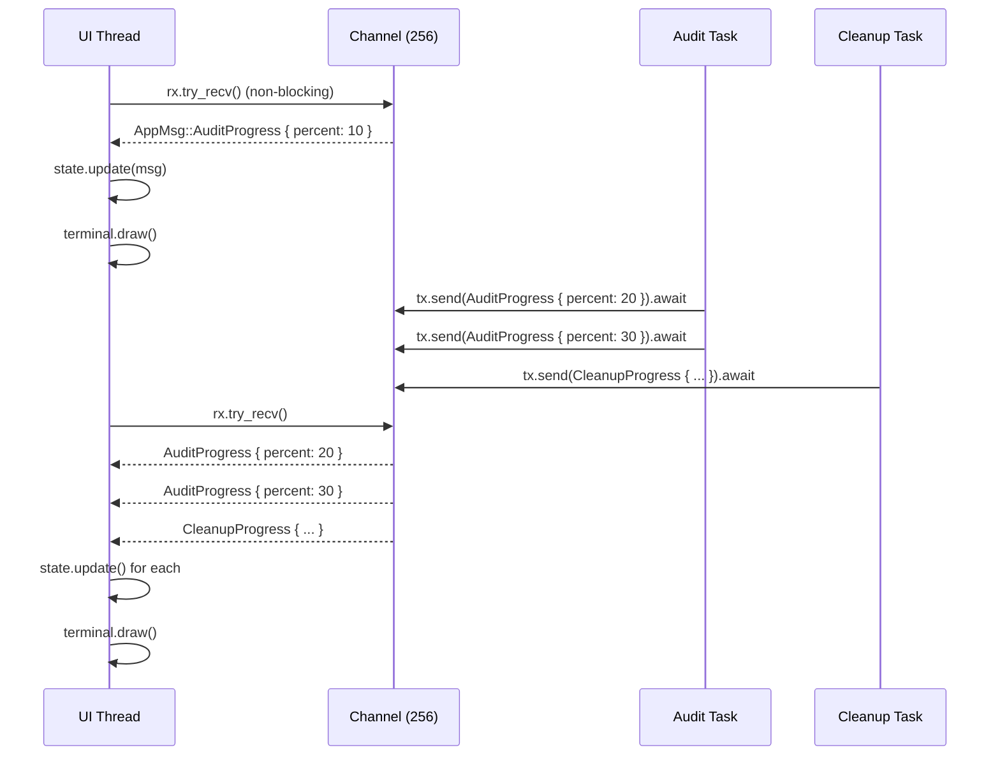
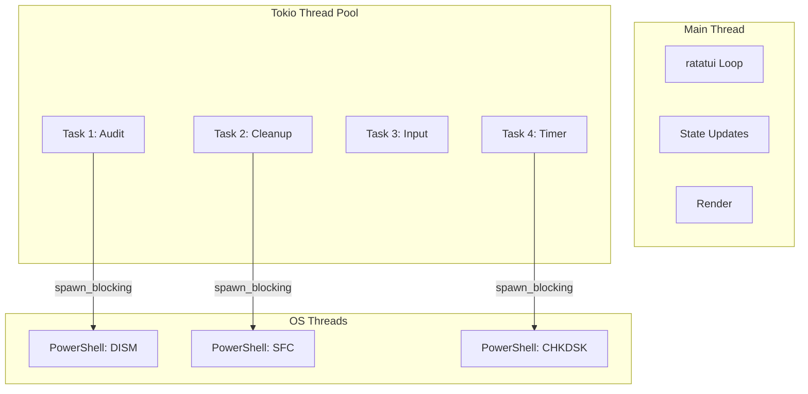
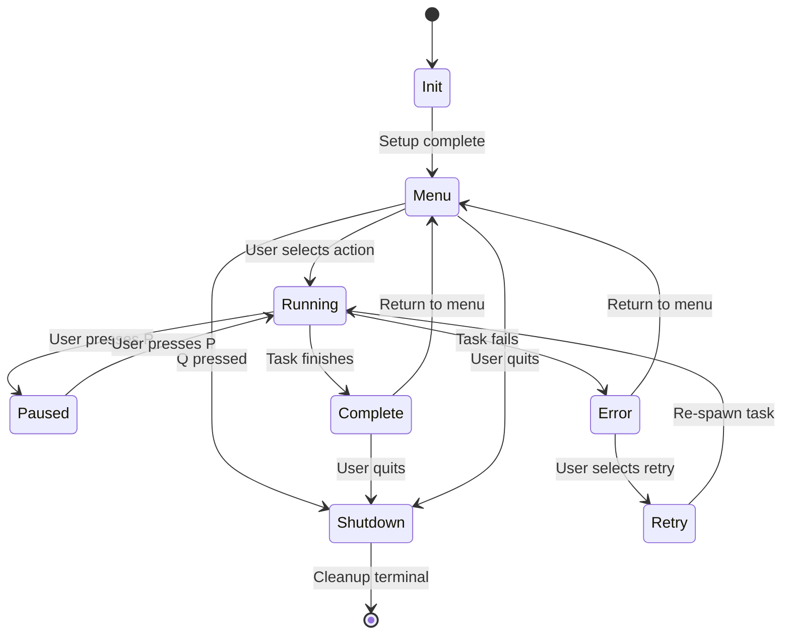

# Runtime Architecture

> Async runtime, threading model, and the MPSC channel bridge.

---

## Table of Contents

- [Runtime Overview](#runtime-overview)
- [MPSC Channel Bridge](#mpsc-channel-bridge)
- [Threading Model](#threading-model)
- [Event Loop](#event-loop)
- [Backpressure Handling](#backpressure-handling)
- [Cancellation](#cancellation)

---

## Runtime Overview



---

## MPSC Channel Bridge

### Problem

ratatui is synchronous by design. terminal.draw() blocks until the frame is rendered. Async tasks (WMI queries, disk cleanup, Windows Update) cannot block the UI thread.

### Solution

tokio::sync::mpsc channel with bounded capacity (backpressure):

```rust
// src/ui/ratatui/mod.rs
use tokio::sync::mpsc::{channel, Sender, Receiver};

pub async fn run_tui() -> Result<(), Box<dyn std::error::Error>> {
    let mut terminal = setup_terminal()?;

    // Bounded channel: 256 messages max
    let (tx, mut rx) = channel::<AppMsg>(256);
    let mut state = AppState::default();

    // Spawn input task (non-blocking keyboard)
    let tx_input = tx.clone();
    tokio::spawn(async move {
        loop {
            if event::poll(Duration::from_millis(50)).unwrap_or(false) {
                if let Ok(Event::Key(key)) = event::read() {
                    if key.kind == KeyEventKind::Press {
                        let msg = map_key_to_msg(key.code);
                        let _ = tx_input.send(msg).await;
                    }
                }
            }
            tokio::time::sleep(Duration::from_millis(10)).await;
        }
    });

    // Main render loop
    let mut last_tick = Instant::now();
    let tick_rate = Duration::from_millis(100);

    loop {
        while let Ok(msg) = rx.try_recv() {
            match msg {
                AppMsg::Shutdown => {
                    cleanup_terminal(&mut terminal)?;
                    return Ok(());
                }
                _ => state.update(msg),
            }
        }

        if last_tick.elapsed() >= tick_rate {
            state.update(AppMsg::Tick);
            last_tick = Instant::now();
        }

        terminal.draw(|frame| render(frame, &mut state))?;
        tokio::time::sleep(Duration::from_millis(16)).await;
    }
}
```

### Message Flow



---

## Threading Model



### CPU Bound Operations

```rust
// For CPU-bound work (Blake3 hashing, file scanning)
use tokio::task::spawn_blocking;

let result = spawn_blocking(|| {
    blake3::hash(&file_contents)
}).await?;
```

### I/O Bound Operations

```rust
// For I/O bound work (WMI, registry, network)
let cpu_info = wmi_provider.cpu().await?;
```

---

## Event Loop



---

## Backpressure Handling

### Bounded Channel (256 messages)

```rust
let (tx, rx) = channel::<AppMsg>(256);
```

| Scenario | Behavior |
|----------|----------|
| Channel has space | send() returns immediately (non-blocking) |
| Channel full | send().await waits until space available |
| Task panics | Channel closes, send() returns Err (handled gracefully) |
| UI thread blocked | Messages accumulate up to 256, then async tasks naturally slow down |

### Overflow Strategy

```rust
while rx.len() > 200 {
    if let Ok(AppMsg::Tick) = rx.try_recv() {
        continue;
    }
    break;
}
```

---

## Cancellation

### Cooperative Cancellation

```rust
use tokio_util::sync::CancellationToken;

let token = CancellationToken::new();
let child_token = token.child_token();

let handle = tokio::spawn(async move {
    tokio::select! {
        _ = child_token.cancelled() => {
            log::info!("Task cancelled gracefully");
            return;
        }
        result = audit_task.run() => {
            result
        }
    }
});

if user_pressed_esc {
    token.cancel();
    handle.await?;
}
```

---

*Last updated: 2026-06-20 | Document version: 1.0*
