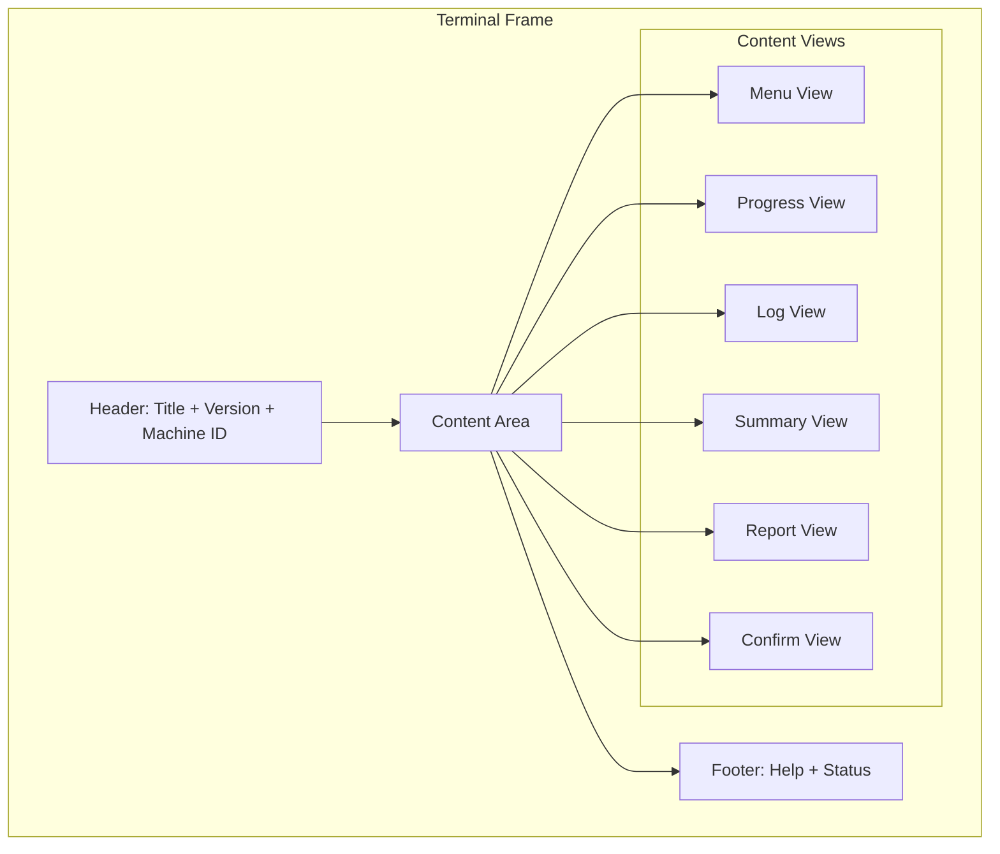
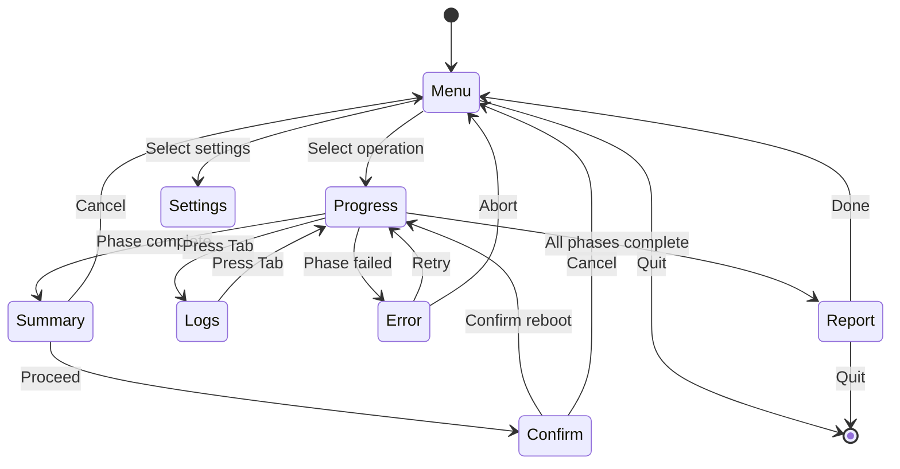

# UI Architecture

> TUI (ratatui) and GUI (iced) implementations.

---

## Table of Contents

- [UI Trait](#ui-trait)
- [TUI Architecture](#tui-architecture)
- [GUI Architecture (Future)](#gui-architecture-future)
- [Shared Components](#shared-components)
- [Theme System](#theme-system)

---

## UI Trait

```rust
// src/ui/mod.rs
pub trait Ui: Send + Sync {
    fn run(&mut self, app: &mut App) -> Result<(), UiError>;
    fn render(&mut self, frame: &mut Frame, state: &AppState);
    fn handle_event(&mut self, event: Event) -> Option<AppMsg>;
}

pub enum UiBackend {
    Tui,
    Gui,
    Headless,
}

impl UiBackend {
    pub fn create() -> Box<dyn Ui> {
        match Self::detect() {
            UiBackend::Tui => Box::new(RatatuiUi::new()),
            UiBackend::Gui => Box::new(IcedUi::new()),
            UiBackend::Headless => Box::new(HeadlessUi::new()),
        }
    }

    fn detect() -> Self {
        if std::env::args().any(|a| a == "--auto-phase") {
            UiBackend::Headless
        } else if cfg!(feature = "gui") {
            UiBackend::Gui
        } else {
            UiBackend::Tui
        }
    }
}
```

---

## TUI Architecture

### Screen Layout



### View State Machine



### Component Hierarchy

```
src/ui/ratatui/
├── mod.rs              # Main loop, channel setup
├── app.rs              # RatatuiApp: view routing, state
├── views/
│   ├── mod.rs          # View trait
│   ├── menu.rs         # Main menu with options
│   ├── progress.rs     # Gauge + detail text
│   ├── logs.rs         # Scrollable log panel
│   ├── summary.rs      # Phase 2 findings
│   ├── confirm.rs      # Reboot confirmation
│   └── report.rs       # Report generation screen
├── widgets/
│   ├── mod.rs
│   ├── header.rs       # Title bar with logo
│   ├── footer.rs       # Key hints + status
│   ├── log_line.rs     # Single log entry with color
│   └── phase_item.rs   # Phase list item with icon
└── theme.rs            # Color palette, styles
```

### Progress Gauge Implementation

```rust
// src/ui/ratatui/views/progress.rs
use ratatui::{
    widgets::{Gauge, Block, Borders},
    style::{Style, Color, Modifier},
};

pub fn render_progress(frame: &mut Frame, state: &AppState, area: Rect) {
    let current_phase = state.current_phase();
    let percent = state.progress_percent();

    let gauge = Gauge::default()
        .block(Block::default()
            .title(format!("Phase {}: {}", current_phase.number, current_phase.name))
            .borders(Borders::ALL))
        .gauge_style(Style::default()
            .fg(Color::Cyan)
            .bg(Color::Black)
            .add_modifier(Modifier::BOLD))
        .percent(percent);

    frame.render_widget(gauge, area);

    let detail = Paragraph::new(state.progress_detail())
        .style(Style::default().fg(Color::Gray));
    frame.render_widget(detail, area.inner(&Margin { vertical: 3, horizontal: 1 }));
}
```

---

## GUI Architecture (Future)

### Iced Application Structure

```rust
// src/ui/iced/mod.rs (stub)
use iced::{Application, Command, Element, Settings};

pub struct HfbApp {
    state: AppState,
    current_view: GuiView,
}

#[derive(Debug, Clone)]
pub enum GuiMessage {
    StartMaintenance,
    PhaseComplete(PhaseResult),
    ProgressUpdate(ProgressData),
    LogReceived(LogEntry),
    RebootConfirmed,
    RebootCancelled,
    ReportGenerated(PathBuf),
}

impl Application for HfbApp {
    type Message = GuiMessage;
    type Theme = HfbTheme;
    type Executor = iced::executor::Default;
    type Flags = ();

    fn new(_flags: ()) -> (Self, Command<GuiMessage>) {
        (HfbApp::default(), Command::none())
    }

    fn title(&self) -> String {
        "Highlander Forge Blade".into()
    }

    fn update(&mut self, message: GuiMessage) -> Command<GuiMessage> {
        match message {
            GuiMessage::StartMaintenance => {
                Command::perform(run_maintenance(), GuiMessage::PhaseComplete)
            }
            // ...
        }
    }

    fn view(&self) -> Element<GuiMessage> {
        match self.current_view {
            GuiView::Dashboard => dashboard_view(&self.state),
            GuiView::Wizard => wizard_view(&self.state),
            GuiView::Progress => progress_view(&self.state),
            GuiView::Report => report_view(&self.state),
        }
    }
}
```

### Planned GUI Views

| View | Description | Iced Widgets |
|------|-------------|--------------|
| Dashboard | System status cards, quick actions | Column, Card, Button |
| Wizard | Step-by-step maintenance flow | Stepper, Button, Text |
| Progress | Animated progress bars, live log | ProgressBar, Scrollable |
| Report | Report preview, export options | Scrollable, Button |
| Settings | Configuration, theme selection | PickList, Toggle, Slider |

---

## Shared Components

### Logo ASCII

```
╔══════════════════════════════════════════════════════════════╗
║                                                              ║
║     ██╗  ██╗██╗ ██████╗ ██╗  ██╗██╗      █████╗ ███╗   ██╗  ║
║     ██║  ██║██║██╔════╝ ██║  ██║██║     ██╔══██╗████╗  ██║  ║
║     ███████║██║██║  ███╗███████║██║     ███████║██╔██╗ ██║  ║
║     ██╔══██║██║██║   ██║██╔══██║██║     ██╔══██║██║╚██╗██║  ║
║     ██║  ██║██║╚██████╔╝██║  ██║███████╗██║  ██║██║ ╚████║  ║
║     ╚═╝  ╚═╝╚═╝ ╚═════╝ ╚═╝  ╚═╝╚══════╝╚═╝  ╚═╝╚═╝  ╚═══╝  ║
║                                                              ║
║              ███████╗ ██████╗ ██████╗  ██████╗ ███████╗      ║
║              ██╔════╝██╔═══██╗██╔══██╗██╔════╝ ██╔════╝      ║
║              █████╗  ██║   ██║██████╔╝██║  ███╗█████╗        ║
║              ██╔══╝  ██║   ██║██╔══██╗██║   ██║██╔══╝        ║
║              ██║     ╚██████╔╝██║  ██║╚██████╔╝███████╗      ║
║              ╚═╝      ╚═════╝ ╚═╝  ╚═╝ ╚═════╝ ╚══════╝      ║
║                                                              ║
║              v3.0.0-alpha.1  |  Professional Windows         ║
║                                Maintenance Engine            ║
╚══════════════════════════════════════════════════════════════╝
```

### Color Palette

| Token | Dark | Light | Usage |
|-------|------|-------|-------|
| primary | #00BCD4 | #0097A7 | Progress bars, active elements |
| success | #4CAF50 | #388E3C | Completed phases, success logs |
| warning | #FFC107 | #FFA000 | Warnings, skipped operations |
| error | #F44336 | #D32F2F | Errors, failed operations |
| info | #2196F3 | #1976D2 | Informational text |
| text | #E0E0E0 | #212121 | Primary text |
| background | #121212 | #FAFAFA | Background |
| surface | #1E1E1E | #FFFFFF | Cards, panels |

---

## Theme System

```toml
# assets/themes/dark.toml
[colors]
primary = "#00BCD4"
success = "#4CAF50"
warning = "#FFC107"
error = "#F44336"
info = "#2196F3"
text = "#E0E0E0"
background = "#121212"
surface = "#1E1E1E"
border = "#333333"

[typography]
font_family = "Cascadia Code, Consolas, monospace"
font_size_small = 10
font_size_normal = 12
font_size_large = 14

[layout]
header_height = 3
footer_height = 2
padding = 1
border_style = "rounded"
```

---

*Last updated: 2026-06-20 | Document version: 1.0*
