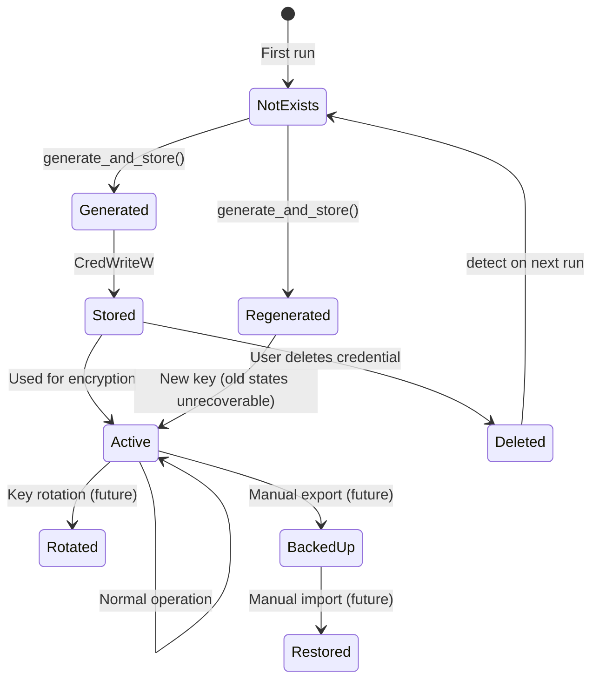

# Windows Credential Manager Integration

> Secure key storage without hardcoded secrets.

---

## Table of Contents

- [Design Decision](#design-decision)
- [Implementation](#implementation)
- [Key Lifecycle](#key-lifecycle)
- [Recovery](#recovery)
- [Alternatives Considered](#alternatives-considered)

---

## Design Decision

**Decision**: Use Windows Credential Manager for AES-256-GCM key storage (DT-04)  
**Status**: Accepted  
**Date**: 2026-06-18

### Context

HFB needs to encrypt the maintenance state file (`estado_manutencao.json`) to protect sensitive system information. The encryption key must:
- Survive application reinstallation
- Not be hardcoded in source
- Not be derivable from hardware (HW IDs change on motherboard replacement, VM cloning)
- Be protected by the OS

### Decision

Store a randomly generated 256-bit AES key in the Windows Credential Manager as a `CRED_TYPE_GENERIC` credential with `CRED_PERSIST_LOCAL_MACHINE` scope.

### Consequences

- **Positive**: Key protected by Windows DPAPI; survives app reinstall; no hardcoded secrets
- **Positive**: User can backup/restore credentials via Windows built-in tools
- **Negative**: Key lost if Credential Manager corrupted or user deletes credential
- **Negative**: Not portable across machines (by design — prevents state file theft)

---

## Implementation

### Credential Operations

```rust
// src/app/crypto.rs
use windows::Win32::Security::Credentials::{
    CredWriteW, CredReadW, CredDeleteW,
    CREDENTIALW, CRED_TYPE_GENERIC, CRED_PERSIST_LOCAL_MACHINE,
};
use windows::core::PCWSTR;

const CRED_TARGET_NAME: &str = "HighlanderForgeBlade:StateKey";
const CRED_USERNAME: &str = "HFB";

pub struct CredentialManager;

impl CredentialManager {
    /// Read existing credential or return None
    pub fn read_key() -> Result<Option<[u8; 32]>, CredentialError> {
        let target_wide: Vec<u16> = CRED_TARGET_NAME.encode_utf16().chain(std::iter::once(0)).collect();

        let mut cred_ptr = std::ptr::null_mut();
        unsafe {
            let result = CredReadW(
                PCWSTR(target_wide.as_ptr()),
                CRED_TYPE_GENERIC,
                0,
                &mut cred_ptr,
            );

            if result.is_err() {
                return Ok(None);
            }

            let cred = &*cred_ptr;
            let secret = std::slice::from_raw_parts(
                cred.CredentialBlob,
                cred.CredentialBlobSize as usize,
            );

            let key: [u8; 32] = secret.try_into()
                .map_err(|_| CredentialError::InvalidKeyLength)?;

            // Free credential memory
            windows::Win32::Security::Credentials::CredFree(cred_ptr as _);

            Ok(Some(key))
        }
    }

    /// Write credential to Credential Manager
    pub fn write_key(key: &[u8; 32]) -> Result<(), CredentialError> {
        let target_wide: Vec<u16> = CRED_TARGET_NAME.encode_utf16().chain(std::iter::once(0)).collect();
        let username_wide: Vec<u16> = CRED_USERNAME.encode_utf16().chain(std::iter::once(0)).collect();

        let cred = CREDENTIALW {
            Type: CRED_TYPE_GENERIC,
            TargetName: windows::core::PWSTR(target_wide.as_ptr() as _),
            CredentialBlobSize: key.len() as u32,
            CredentialBlob: key.as_ptr() as _,
            Persist: CRED_PERSIST_LOCAL_MACHINE,
            UserName: windows::core::PWSTR(username_wide.as_ptr() as _),
            ..Default::default()
        };

        unsafe {
            CredWriteW(&cred, 0)?;
        }

        Ok(())
    }

    /// Generate new random key and store it
    pub fn generate_and_store() -> Result<[u8; 32], CredentialError> {
        let mut key = [0u8; 32];
        rand::thread_rng().fill_bytes(&mut key);
        Self::write_key(&key)?;
        Ok(key)
    }

    /// Get or create key (idempotent)
    pub fn get_or_create_key() -> Result<[u8; 32], CredentialError> {
        if let Some(key) = Self::read_key()? {
            return Ok(key);
        }
        Self::generate_and_store()
    }
}
```

### Encryption/Decryption

```rust
use aes_gcm::{
    aead::{Aead, KeyInit},
    Aes256Gcm, Nonce,
};

pub fn encrypt_state(plaintext: &[u8]) -> Result<Vec<u8>, CryptoError> {
    let key = CredentialManager::get_or_create_key()?;
    let cipher = Aes256Gcm::new_from_slice(&key)
        .map_err(|_| CryptoError::KeyInvalid)?;

    let mut nonce_bytes = [0u8; 12];
    rand::thread_rng().fill_bytes(&mut nonce_bytes);
    let nonce = Nonce::from_slice(&nonce_bytes);

    let ciphertext = cipher.encrypt(nonce, plaintext)
        .map_err(|_| CryptoError::EncryptFailed)?;

    // Format: [nonce (12 bytes)] + [ciphertext]
    let mut result = Vec::with_capacity(12 + ciphertext.len());
    result.extend_from_slice(&nonce_bytes);
    result.extend_from_slice(&ciphertext);

    Ok(result)
}

pub fn decrypt_state(ciphertext: &[u8]) -> Result<Vec<u8>, CryptoError> {
    if ciphertext.len() < 12 {
        return Err(CryptoError::InvalidFormat);
    }

    let key = CredentialManager::get_or_create_key()?;
    let cipher = Aes256Gcm::new_from_slice(&key)
        .map_err(|_| CryptoError::KeyInvalid)?;

    let nonce = Nonce::from_slice(&ciphertext[..12]);
    let plaintext = cipher.decrypt(nonce, &ciphertext[12..])
        .map_err(|_| CryptoError::DecryptFailed)?;

    Ok(plaintext)
}
```

---

## Key Lifecycle



---

## Recovery

### Credential Deleted

**Detection**: `CredReadW` returns `ERROR_NOT_FOUND`  
**Action**: Generate new key, alert user

```rust
pub fn get_or_create_key_with_warning() -> Result<[u8; 32], CredentialError> {
    if let Some(key) = Self::read_key()? {
        return Ok(key);
    }

    // Key not found — generate new one
    log::warn!(
        "Credential 'HighlanderForgeBlade:StateKey' not found. "
        "Generating new key. Previous encrypted states will be unrecoverable."
    );

    Self::generate_and_store()
}
```

### Credential Corrupted

**Detection**: Key length != 32 bytes or decryption fails  
**Action**: Try backup credential name, then regenerate

```rust
const CRED_TARGET_BACKUP: &str = "HighlanderForgeBlade:StateKey:Backup";

pub fn read_key_with_backup() -> Result<Option<[u8; 32]>, CredentialError> {
    // Try primary
    if let Some(key) = Self::read_key()? {
        return Ok(Some(key));
    }

    // Try backup
    let backup_wide: Vec<u16> = CRED_TARGET_BACKUP.encode_utf16().chain(std::iter::once(0)).collect();
    // ... read backup

    Ok(None)
}
```

---

## Alternatives Considered

| Alternative | Pros | Cons | Decision |
|-------------|------|------|----------|
| **Hardware-derived key** | No external storage | HW changes = key lost; VM clones share key | ❌ Rejected |
| **File-based key** | Simple | Unencrypted on disk; vulnerable to theft | ❌ Rejected |
| **Windows DPAPI directly** | Native encryption | Tied to user context; fails for system tasks | ❌ Rejected |
| **Credential Manager** | OS-protected; machine-scoped; survives reinstall | Windows-only; credential can be deleted | ✅ Accepted |
| **TPM/Secure Enclave** | Hardware-backed | Complex; not all machines have TPM | ⚠️ Future (v3.2+) |

---

*Last updated: 2026-06-20 | Document version: 1.0*
