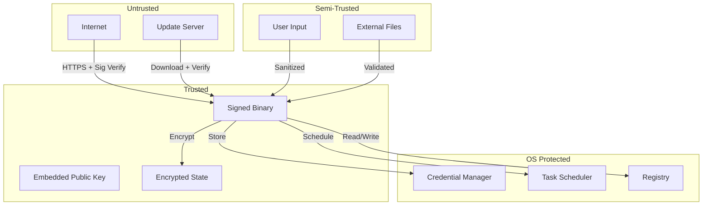
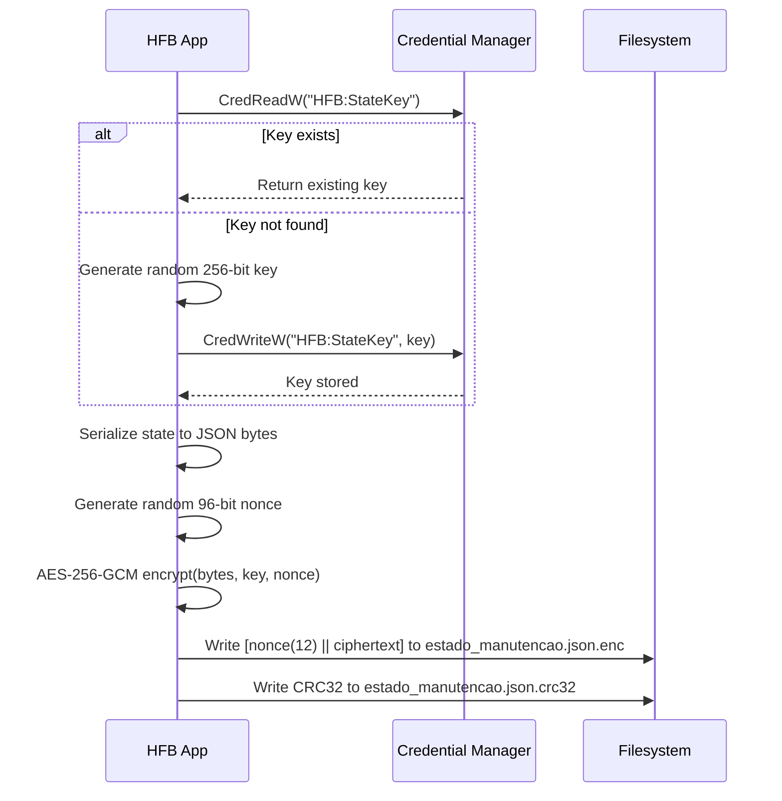
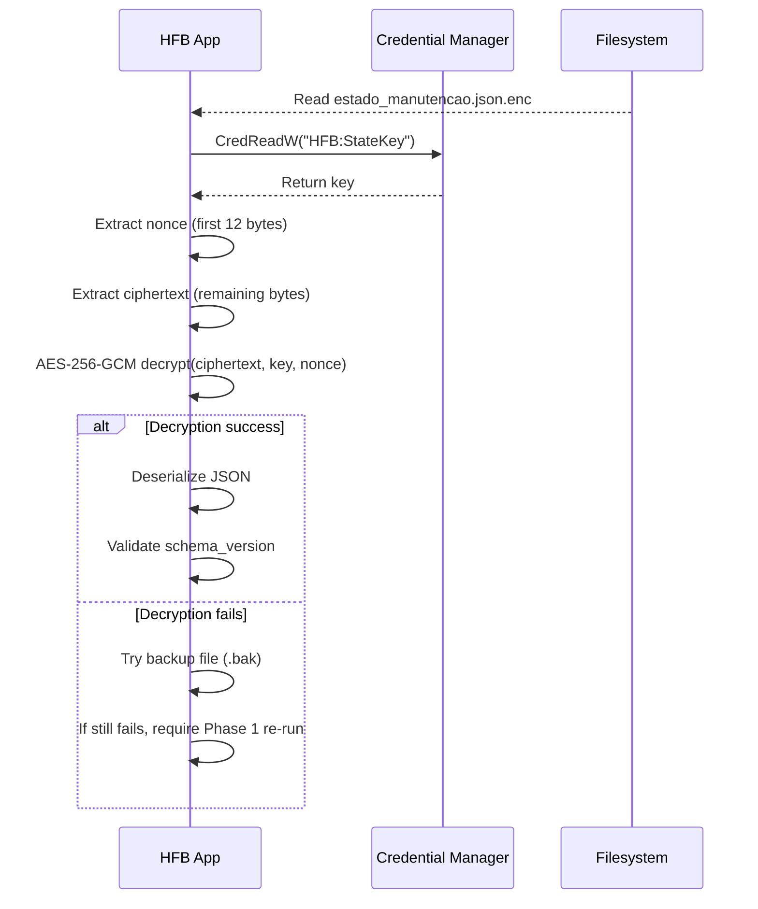
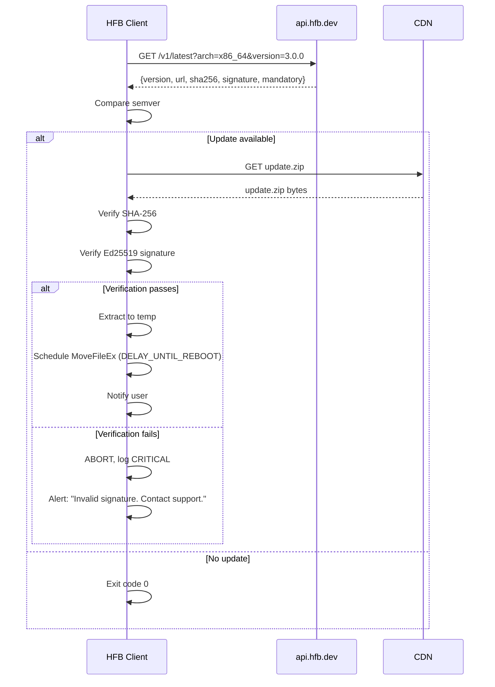

# Security Architecture

> Defense in depth for a tool that runs with Administrator privileges.

---

## Table of Contents

- [Threat Model](#threat-model)
- [Attack Surface](#attack-surface)
- [Cryptographic Primitives](#cryptographic-primitives)
- [State Protection](#state-protection)
- [Update Security](#update-security)
- [Operational Security](#operational-security)

---

## Threat Model

### STRIDE Analysis

| Threat | Component | Mitigation | Status |
|--------|-----------|------------|--------|
| **Spoofing** | Update server | Ed25519 signature verification (DT-11) | ✅ Implemented |
| **Tampering** | State file | AES-256-GCM + CRC32 checksum | ✅ Implemented |
| **Repudiation** | Audit logs | Structured JSON logs with timestamps | ✅ Implemented |
| **Information Disclosure** | Credential storage | Windows Credential Manager | ✅ Implemented |
| **Denial of Service** | State corruption | Atomic writes + backups | ✅ Implemented |
| **Elevation of Privilege** | Service manipulation | Requires admin, logged | ✅ Implemented |

### Trust Boundaries



---

## Attack Surface

### Binary

| Vector | Risk | Mitigation |
|--------|------|------------|
| Buffer overflow in JSON parsing | Low | Rust memory safety |
| Integer overflow in progress calc | Low | Checked arithmetic |
| Path traversal in file cleanup | Medium | Canonicalize paths, whitelist |
| Command injection in PowerShell | Medium | Parameterized commands, no shell interpolation |
| DLL hijacking | Medium | Static linking where possible, signed DLLs |

### Network

| Vector | Risk | Mitigation |
|--------|------|------------|
| Man-in-the-middle (update) | High | TLS 1.3 + certificate pinning + Ed25519 signature |
| Replay attack (update) | Medium | Timestamp + nonce in signature |
| Downgrade attack | Medium | Reject older versions than current |

---

## Cryptographic Primitives

| Purpose | Algorithm | Key Size | Source |
|---------|-----------|----------|--------|
| State encryption | AES-256-GCM | 256-bit | Randomly generated, Credential Manager |
| Update signature verification | Ed25519 | 256-bit | Compile-time embedded |
| State integrity | CRC32 | 32-bit | Sidecar file |
| Checksum (report) | SHA-256 | 256-bit | Report metadata |

---

## State Protection

### Encryption Flow



### Decryption Flow



---

## Update Security

### Signature Verification

```rust
// src/app/update.rs
use ed25519_dalek::{VerifyingKey, Signature};

/// Compile-time embedded public key (DT-11)
const UPDATE_PUBLIC_KEY_BYTES: &[u8] = include_bytes!("../../assets/update_pubkey.bin");

pub struct UpdateVerifier;

impl UpdateVerifier {
    pub fn verifying_key() -> Result<VerifyingKey, UpdateError> {
        let bytes: [u8; 32] = UPDATE_PUBLIC_KEY_BYTES
            .try_into()
            .map_err(|_| UpdateError::InvalidKeyLength)?;

        VerifyingKey::from_bytes(&bytes)
            .map_err(|_| UpdateError::InvalidKey)
    }

    pub fn verify_archive(archive: &[u8], signature_hex: &str) -> Result<(), UpdateError> {
        let key = Self::verifying_key()?;
        let signature_bytes = hex::decode(signature_hex)
            .map_err(|_| UpdateError::InvalidSignatureFormat)?;
        let signature = Signature::from_slice(&signature_bytes)
            .map_err(|_| UpdateError::InvalidSignature)?;

        key.verify_strict(archive, &signature)
            .map_err(|_| UpdateError::SignatureVerificationFailed)
    }
}
```

### Update Flow



### Key Rotation

| Event | Action | User Impact |
|-------|--------|-------------|
| Major version release (v3→v4) | New key pair generated | Old binary cannot verify v4 updates; manual download required |
| Key compromise detected | Emergency release with new key | All users must manually update once |
| Routine rotation | Annual key refresh | Transparent if auto-updating |

---

## Operational Security

### Privilege Requirements

| Operation | Required Privilege | Justification |
|-----------|-------------------|---------------|
| WMI queries | Administrator | Access to system hardware info |
| Registry modifications | Administrator | Service start types, Run keys |
| Service control | Administrator | Stop/start Windows services |
| Windows Update | Administrator | Install system updates |
| SFC / DISM | Administrator | System file repair |
| CHKDSK | Administrator | Disk surface scan |
| Task Scheduler | Administrator | Create system-level tasks |
| Credential Manager | Administrator | Write machine-level credentials |

### Audit Logging

All privileged operations logged with:
- Timestamp (RFC 3339, UTC)
- Operation type
- Target (file, registry key, service name)
- Result (success/failure)
- Calling user (if available)
- Process ID

```json
{
  "timestamp": "2026-06-20T22:15:32.123Z",
  "level": "INFO",
  "target": "hfb::core::services",
  "fields": {
    "message": "Service start type changed",
    "service": "Fax",
    "old_start_type": "Auto",
    "new_start_type": "Disabled",
    "operation": "set_start_type"
  },
  "span": {
    "name": "cleanup_services",
    "phase": "3"
  }
}
```

---

*Last updated: 2026-06-20 | Document version: 1.0*
