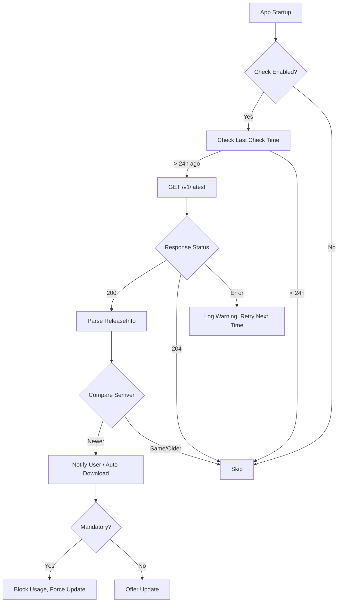
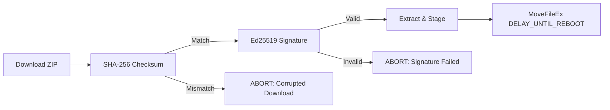

# Auto-Update System

> Secure, signed, atomic update mechanism.

---

## Table of Contents

- [Update Architecture](#update-architecture)
- [Verification Pipeline](#verification-pipeline)
- [Deployment Strategies](#deployment-strategies)
- [Rollback](#rollback)
- [Enterprise Controls](#enterprise-controls)

---

## Update Architecture

### Channels

| Channel | Audience | Stability | Auto-Update |
|---------|----------|-----------|-------------|
| **Stable** | All users | Production-ready | Yes (default) |
| **Beta** | Early adopters | Feature-complete, testing | Opt-in (`--beta`) |
| **Nightly** | Contributors | Bleeding edge | No |
| **Enterprise** | MSPs / Corporate | Stable + custom patches | Configurable feed |

### Update Check Flow



---

## Verification Pipeline

### Three-Layer Verification



### Implementation

```rust
// src/app/update.rs
pub const UPDATE_ENDPOINT: &str = "https://api.hfb.dev/v1/latest";
pub const CURRENT_VERSION: &str = env!("CARGO_PKG_VERSION");

#[derive(Debug, Deserialize)]
pub struct ReleaseInfo {
    pub version: String,
    pub download_url: String,
    pub checksum_sha256: String,
    pub signature_ed25519: String,
    pub release_notes: String,
    pub mandatory: bool,
}

pub async fn check_update() -> Result<Option<ReleaseInfo>, UpdateError> {
    let client = reqwest::Client::builder()
        .timeout(Duration::from_secs(10))
        .build()?;

    let response = client.get(UPDATE_ENDPOINT)
        .query(&[
            ("channel", "stable"),
            ("arch", std::env::consts::ARCH),
            ("os", std::env::consts::OS),
            ("version", CURRENT_VERSION),
        ])
        .send().await?;

    if response.status() == 204 {
        return Ok(None); // No update available
    }

    let release: ReleaseInfo = response.json().await?;

    let current = semver::Version::parse(CURRENT_VERSION)?;
    let latest = semver::Version::parse(&release.version)?;

    if latest > current {
        Ok(Some(release))
    } else {
        Ok(None)
    }
}

pub async fn download_and_verify(release: &ReleaseInfo) -> Result<Vec<u8>, UpdateError> {
    let client = reqwest::Client::builder()
        .timeout(Duration::from_secs(300))
        .build()?;

    let response = client.get(&release.download_url).send().await?;
    let bytes = response.bytes().await?;

    // Layer 1: SHA-256
    let hash = sha2::Sha256::digest(&bytes);
    let expected_hash = hex::decode(&release.checksum_sha256)?;
    if hash.as_slice() != expected_hash.as_slice() {
        return Err(UpdateError::ChecksumMismatch);
    }

    // Layer 2: Ed25519
    UpdateVerifier::verify_archive(&bytes, &release.signature_ed25519)?;

    Ok(bytes.into())
}
```

---

## Deployment Strategies

### Self-Replacement (Windows)

```rust
pub fn stage_update(archive_bytes: &[u8]) -> Result<(), UpdateError> {
    let update_dir = Path::new(r"C:\ManutencaoWindows\updates");
    std::fs::create_dir_all(update_dir)?;

    // Extract to staging directory
    let temp_dir = update_dir.join(format!("v{}", release.version));
    extract_zip(archive_bytes, &temp_dir)?;

    // Schedule replacement on next boot
    let current_exe = std::env::current_exe()?;
    let new_exe = temp_dir.join("hfb.exe");

    unsafe {
        use windows::Win32::Storage::FileSystem::MoveFileExW;

        let current_wide: Vec<u16> = current_exe.as_os_str()
            .encode_wide()
            .chain(std::iter::once(0))
            .collect();
        let new_wide: Vec<u16> = new_exe.as_os_str()
            .encode_wide()
            .chain(std::iter::once(0))
            .collect();

        MoveFileExW(
            windows::core::PCWSTR(current_wide.as_ptr()),
            windows::core::PCWSTR(new_wide.as_ptr()),
            windows::Win32::Storage::FileSystem::MOVEFILE_DELAY_UNTIL_REBOOT,
        )?;
    }

    Ok(())
}
```

### Alternative: Separate Updater Process

For immediate updates (not requiring reboot):

```rust
// Spawn updater.exe that:
// 1. Waits for hfb.exe to exit
// 2. Replaces hfb.exe with new version
// 3. Restarts hfb.exe
// 4. Self-deletes
```

---

## Rollback

### Automatic Rollback Triggers

| Condition | Action |
|-----------|--------|
| New binary crashes on startup (3 times) | Restore from backup |
| Update verification fails | Keep current binary, delete staging |
| User cancels during download | Delete partial download |
| MoveFileEx fails | Log error, retry on next run |

### Backup Strategy

```
C:\ManutencaoWindows\
├── hfb.exe              ← Current binary
├── hfb.exe.bak          ← Previous version (kept 1)
└── updates\
    └── v3.0.1\
        └── hfb.exe      ← Staged update
```

---

## Enterprise Controls

### Configuration

```toml
# config.toml
[update]
enabled = true
channel = "enterprise"
endpoint = "https://internal.company.com/hfb/updates"
check_interval_hours = 24
auto_download = false
auto_install = false
allow_downgrades = false

[update.enterprise]
certificate_pin = "sha256//abc123..."  # Optional pinning
custom_ca = "C:\Company\ca.crt"       # Internal CA
```

### Group Policy Support

Registry keys for enterprise control:

```
HKLM\SOFTWARE\Policies\HighlanderForge\HFB\
    UpdateEnabled      REG_DWORD  0x0 or 0x1
    UpdateChannel      REG_SZ     "enterprise"
    UpdateEndpoint     REG_SZ     "https://internal.company.com"
    UpdateAutoInstall  REG_DWORD  0x0
```

---

*Last updated: 2026-06-20 | Document version: 1.0*
