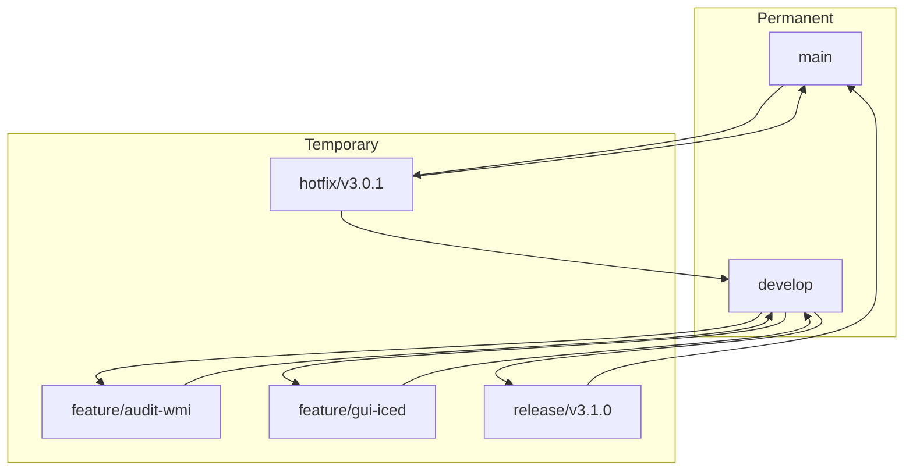

# Branching Strategy

> Git Flow adapted for Rust binary releases.

---

## Table of Contents

- [Branch Types](#branch-types)
- [Workflow](#workflow)
- [Commit Convention](#commit-convention)
- [Pull Request Template](#pull-request-template)
- [Merge Rules](#merge-rules)

---

## Branch Types



### main

- **Purpose**: Production releases only
- **Protection**: Require 2 reviews, CI pass, signed commits
- **Tags**: All version tags (`v3.0.0`, `v3.0.1`)
- **Merges**: Only from `release/*` or `hotfix/*`

### develop

- **Purpose**: Integration branch for next release
- **Protection**: Require 1 review, CI pass
- **Version**: `X.Y.Z-alpha.N` in Cargo.toml
- **Merges**: From `feature/*`, `hotfix/*`

### feature/*

- **Naming**: `feature/short-description` or `feature/ADR-NNN-description`
- **Source**: `develop`
- **Target**: `develop`
- **Lifetime**: Until merged
- **CI**: Linux tests only (fast)

### release/*

- **Naming**: `release/vX.Y.Z`
- **Source**: `develop`
- **Target**: `main` and `develop`
- **Lifetime**: Until release tagged
- **CI**: Full pipeline + Windows integration tests
- **Rules**: No new features, only bug fixes and documentation

### hotfix/*

- **Naming**: `hotfix/vX.Y.Z` (patch version bump)
- **Source**: `main`
- **Target**: `main` and `develop`
- **Lifetime**: Until merged to both branches
- **CI**: Full pipeline + Windows build
- **Rules**: Critical fixes only; must have issue reference

---

## Workflow

### Starting a Feature

```bash
# Ensure develop is up to date
git checkout develop
git pull origin develop

# Create feature branch
git checkout -b feature/audit-wmi-fallback

# Work, commit, push
git add .
git commit -m "feat(audit): add WMI fallback to registry provider"
git push origin feature/audit-wmi-fallback

# Create PR via GitHub CLI or web
gh pr create --title "feat(audit): WMI fallback for restricted environments"              --body "Closes #123"              --base develop
```

### Creating a Release

```bash
# 1. Freeze develop, create release branch
git checkout develop
git checkout -b release/v3.1.0

# 2. Update version in Cargo.toml
# version = "3.1.0-beta.1" → "3.1.0"

# 3. Update CHANGELOG.md

# 4. Commit
git add Cargo.toml CHANGELOG.md
git commit -m "chore(release): prepare v3.1.0"

# 5. Push and create PR to main
git push origin release/v3.1.0
gh pr create --title "Release v3.1.0" --base main

# 6. After merge, tag
git checkout main
git pull origin main
git tag -a v3.1.0 -m "Release v3.1.0"
git push origin v3.1.0
```

### Hotfix Workflow

```bash
# 1. Create from main
git checkout main
git checkout -b hotfix/v3.0.1

# 2. Fix bug, update version and CHANGELOG
git add .
git commit -m "fix(core): prevent state corruption on power loss

Fixes #456"

# 3. Push and create PRs
git push origin hotfix/v3.0.1
gh pr create --title "Hotfix v3.0.1" --base main
gh pr create --title "Hotfix v3.0.1 → develop" --base develop

# 4. After both merges, tag
git checkout main
git tag -a v3.0.1 -m "Hotfix v3.0.1"
git push origin v3.0.1
```

---

## Commit Convention

Based on [Conventional Commits](https://www.conventionalcommits.org/):

```
<type>(<scope>): <description>

[optional body]

[optional footer(s)]
```

### Types

| Type | Description | Example |
|------|-------------|---------|
| `feat` | New feature | `feat(tui): add progress gauge widget` |
| `fix` | Bug fix | `fix(core): handle WMI timeout gracefully` |
| `docs` | Documentation only | `docs(readme): update installation steps` |
| `style` | Code style (formatting) | `style(fmt): apply rustfmt` |
| `refactor` | Code refactoring | `refactor(audit): split WMI into submodules` |
| `perf` | Performance improvement | `perf(cleanup): parallelize file deletion` |
| `test` | Tests | `test(integration): add state migration test` |
| `chore` | Maintenance | `chore(deps): update tokio to 1.38` |
| `ci` | CI/CD changes | `ci(github): add Windows integration tests` |
| `security` | Security fix | `security(update): verify Ed25519 signatures` |

### Scopes

| Scope | Area |
|-------|------|
| `app` | Application layer (state, messages, commands) |
| `core` | Domain layer (audit, cleanup, repair) |
| `ui` | UI layer (ratatui, iced) |
| `platform` | Platform abstractions (WMI, registry, services) |
| `security` | Security features (crypto, updates) |
| `docs` | Documentation |
| `ci` | CI/CD |
| `deps` | Dependencies |

### Examples

```
feat(core): add Blake3 file indexing module

Implements incremental file hashing with SQLite backend.
Supports resume after interruption via checkpoint system.

Closes #789
```

```
fix(ui): prevent panic on terminal resize during progress

Ratatui would panic when terminal width < 80 columns.
Now clamps minimum width and shows compact view.

Fixes #234
```

```
security(crypto): rotate update signing key

New Ed25519 key pair for v3.1.0+ releases.
Old key added to revocation list for verification.

BREAKING CHANGE: v3.0.x binaries cannot auto-update to v3.1.0+
```

---

## Pull Request Template

```markdown
## Description

Brief description of changes.

## Type of Change

- [ ] Bug fix (non-breaking)
- [ ] New feature (non-breaking)
- [ ] Breaking change
- [ ] Documentation update
- [ ] Performance improvement
- [ ] Security fix

## Testing

- [ ] Unit tests added/updated
- [ ] Integration tests pass (Linux)
- [ ] Manual testing on Windows (if platform-specific)
- [ ] `cargo test --all-features` passes

## Checklist

- [ ] Code follows style guidelines (`cargo fmt`, `cargo clippy`)
- [ ] CHANGELOG.md updated (if user-facing)
- [ ] Documentation updated (if API changes)
- [ ] Security implications considered
- [ ] Backwards compatibility maintained (or documented breaking change)

## Related Issues

Closes #XXX
```

---

## Merge Rules

### Squash vs Merge

| Branch Type | Strategy | Reason |
|-------------|----------|--------|
| `feature/*` → `develop` | Squash | Clean history, single commit per feature |
| `release/*` → `main` | Merge commit | Preserve release branch history |
| `hotfix/*` → `main` | Merge commit | Traceability for critical fixes |
| `hotfix/*` → `develop` | Squash | Already in main, just sync develop |

### Merge Requirements

| Check | feature → develop | release → main | hotfix → main |
|-------|:---------------:|:------------:|:-------------:|
| CI pass (Linux) | ✅ | ✅ | ✅ |
| CI pass (Windows) | ❌ | ✅ | ✅ |
| Code review | 1 | 2 | 2 |
| Security review | ❌ | ✅ (if security-related) | ✅ |
| CHANGELOG updated | ❌ | ✅ | ✅ |
| Version bumped | ❌ | ✅ | ✅ |
| Signed commits | ❌ | ✅ | ✅ |

---

*Last updated: 2026-06-20 | Document version: 1.0*
