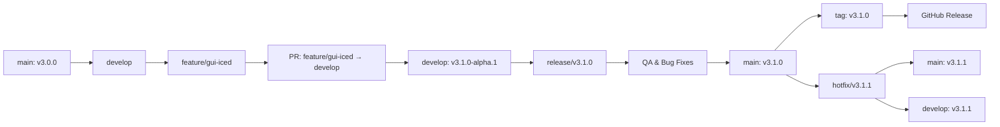

# Versioning & Releases

> Semantic versioning, release branches, and LTS policy.

---

## Table of Contents

- [Versioning Scheme](#versioning-scheme)
- [Release Branches](#release-branches)
- [LTS Policy](#lts-policy)
- [Changelog Format](#changelog-format)
- [Pre-releases](#pre-releases)

---

## Versioning Scheme

HFB follows [Semantic Versioning 2.0.0](https://semver.org/):

```
MAJOR.MINOR.PATCH[-prerelease][+build]

Examples:
  3.0.0-alpha.1   # First alpha of v3
  3.0.0-beta.2    # Second beta
  3.0.0           # Stable release
  3.1.0           # New feature (GUI)
  3.1.1           # Bug fix
  4.0.0           # Breaking change (SaaS)
```

### Version Components

| Component | Meaning | Example |
|-----------|---------|---------|
| `MAJOR` | Breaking changes, new architecture | v3→v4 (SaaS) |
| `MINOR` | New features, backward compatible | v3.0→v3.1 (GUI) |
| `PATCH` | Bug fixes, security patches | v3.0.0→v3.0.1 |
| `prerelease` | Alpha, beta, rc | `-alpha.1`, `-beta.2`, `-rc.1` |

---

## Release Branches



### Branch Rules

| Branch | Pattern | Protection | CI |
|--------|---------|------------|-----|
| `main` | — | Require PR + 2 reviews + CI pass | Full + Windows build |
| `develop` | — | Require PR + 1 review + CI pass | Full |
| `release/*` | `release/vX.Y.Z` | Require PR + 2 reviews + QA sign-off | Full + Integration |
| `hotfix/*` | `hotfix/vX.Y.Z` | Require PR + 2 reviews + CI pass | Full + Windows build |
| `feature/*` | `feature/description` | Require PR + 1 review + CI pass | Linux only |

---

## LTS Policy

### Long-Term Support Releases

| Version | Release Date | End of Support | MSRV |
|---------|-------------|----------------|------|
| **3.0.x** | 2026-Q3 | 2027-Q3 | 1.78 |
| 3.1.x | 2026-Q4 | 2027-Q4 | 1.78 |

### LTS Commitments

- **Security patches**: Backported for 12 months after release
- **Critical bug fixes**: Backported for 12 months after release
- **Feature backports**: Not guaranteed; evaluated case-by-case
- **Dependency updates**: Only security-critical updates

### Using LTS

```toml
# Cargo.toml — pin to LTS minor version
[dependencies]
highlander-forge-blade = { version = "~3.0", features = ["tui"] }
```

```powershell
# Download specific LTS release
Invoke-WebRequest -Uri "https://github.com/highlanderviralcenter-lab/highlander-forge-blade/releases/download/v3.0.5/hfb.exe" -OutFile "hfb.exe"
```

---

## Changelog Format

Based on [Keep a Changelog](https://keepachangelog.com/):

```markdown
# Changelog

All notable changes to this project will be documented in this file.

The format is based on [Keep a Changelog](https://keepachangelog.com/en/1.1.0/),
and this project adheres to [Semantic Versioning](https://semver.org/spec/v2.0.0.html).

## [Unreleased]

### Added
- GUI mode using iced 0.13 (feature flag `gui`)

### Changed
- Improved WMI fallback detection speed

### Fixed
- Memory leak in log panel during long-running operations

### Security
- Updated `reqwest` to 0.12.5 (CVE-2026-XXXX)

## [3.0.0] - 2026-08-15

### Added
- Full 5-phase maintenance cycle (Audit → Cleanup → Reboot → Repair)
- TUI with ratatui 0.29
- Headless mode with JSON output
- Auto-update with Ed25519 signature verification
- Windows Credential Manager key storage
- State versioning with automatic migration
- Dual-mode logging (human + JSON)

### Changed
- Migrated from PowerShell script to Rust binary

### Fixed
- Phase 5 not executing after reboot on Windows 11 24H2

## [3.0.0-beta.2] - 2026-07-20

### Added
- Task Scheduler integration for Phase 5
- Auto-update download and verification

### Fixed
- State corruption when power lost during Phase 3

## [3.0.0-beta.1] - 2026-07-01

### Added
- Headless mode (`--auto-phase`, `--format=json`)
- Standardized exit codes

## [3.0.0-alpha.2] - 2026-06-15

### Added
- Phase 1: Full system audit
- HTML report generation

## [3.0.0-alpha.1] - 2026-06-01

### Added
- Project skeleton
- ratatui menu and navigation
- CI with mock-based tests

[Unreleased]: https://github.com/highlanderviralcenter-lab/highlander-forge-blade/compare/v3.0.0...HEAD
[3.0.0]: https://github.com/highlanderviralcenter-lab/highlander-forge-blade/compare/v3.0.0-beta.2...v3.0.0
[3.0.0-beta.2]: https://github.com/highlanderviralcenter-lab/highlander-forge-blade/compare/v3.0.0-beta.1...v3.0.0-beta.2
```

---

## Pre-releases

### Alpha

- **Stability**: Unstable, may have breaking changes between alpha releases
- **Audience**: Core contributors, early testers
- **Support**: Community only, no guarantees
- **Updates**: Frequent, may require manual migration

### Beta

- **Stability**: Feature-complete, known bugs documented
- **Audience**: Early adopters, MSPs testing deployment
- **Support**: Issue tracker, best effort
- **Updates**: Weekly or bi-weekly

### Release Candidate (RC)

- **Stability**: Production-ready, final testing
- **Audience**: All users preparing for upgrade
- **Support**: Full support, treated as release
- **Updates**: Only critical fixes

### Pre-release Installation

```powershell
# Install latest alpha
hfb --check-update --channel=alpha

# Install specific beta
Invoke-WebRequest -Uri "https://github.com/highlanderviralcenter-lab/highlander-forge-blade/releases/download/v3.1.0-beta.1/hfb.exe" -OutFile "hfb-beta.exe"
```

---

*Last updated: 2026-06-20 | Document version: 1.0*
