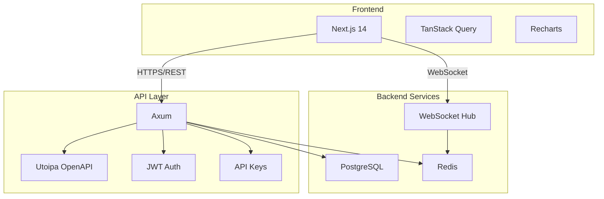

# SaaS API & Portal (v4.0.0)

> Fleet management dashboard and REST API for MSPs.

---

## Table of Contents

- [Architecture](#architecture)
- [API Specification](#api-specification)
- [Authentication](#authentication)
- [Real-Time Features](#real-time-features)
- [Frontend](#frontend)

---

## Architecture

### Stack

| Layer | Technology | Justification |
|-------|-----------|---------------|
| Frontend | Next.js 14 (App Router) | SSR, React Server Components, mature ecosystem |
| Styling | Tailwind CSS + shadcn/ui | Utility-first, accessible components |
| State | TanStack Query | Server state caching, background refetch |
| Charts | Recharts | React-native, customizable |
| API | Axum (Rust) | Reuse domain logic, performance, type safety |
| Auth | JWT + API Keys | Flexible for users and RMM integrations |
| Database | PostgreSQL | Relational data, complex queries, ACID |
| Cache | Redis | Rate limiting, session store, real-time pub/sub |
| Real-Time | WebSocket | Live alerts, fleet status updates |



---

## API Specification

### OpenAPI (Utoipa)

```rust
// src/api/main.rs (future)
use axum::{
    routing::{get, post},
    Router, Json,
};
use utoipa::{OpenApi, ToSchema};
use serde::{Deserialize, Serialize};

#[derive(OpenApi)]
#[openapi(
    paths(
        get_machines,
        get_machine_reports,
        upload_report,
    ),
    components(
        schemas(Machine, Report, MaintenanceResult)
    ),
    tags(
        (name = "machines", description = "Machine management"),
        (name = "reports", description = "Report operations"),
    )
)]
struct ApiDoc;

#[derive(Serialize, Deserialize, ToSchema)]
pub struct Machine {
    #[schema(example = "a1b2c3d4-e5f6-7890-abcd-ef1234567890")]
    pub machine_id: String,
    #[schema(example = "MACHINE-01")]
    pub name: String,
    pub last_seen: chrono::DateTime<chrono::Utc>,
    pub status: MachineStatus,
    pub os_version: String,
}

#[derive(Serialize, Deserialize, ToSchema)]
pub enum MachineStatus {
    Online,
    Offline,
    Maintenance,
    Error,
}

#[utoipa::path(
    get,
    path = "/api/v1/machines",
    responses(
        (status = 200, description = "List of machines", body = Vec<Machine>),
        (status = 401, description = "Unauthorized"),
    ),
    security(
        ("api_key" = []),
        ("bearer" = [])
    )
)]
async fn get_machines(
    State(pool): State<SqlitePool>,
    auth: Auth,
) -> Result<Json<Vec<Machine>>, ApiError> {
    // ...
}
```

### Endpoints

| Method | Path | Description | Auth |
|--------|------|-------------|------|
| `GET` | `/api/v1/machines` | List all machines | API Key / JWT |
| `GET` | `/api/v1/machines/{id}` | Machine details | API Key / JWT |
| `GET` | `/api/v1/machines/{id}/reports` | Machine reports | API Key / JWT |
| `POST` | `/api/v1/reports` | Upload report | API Key |
| `GET` | `/api/v1/reports/{id}` | Get report | API Key / JWT |
| `GET` | `/api/v1/fleet/stats` | Fleet statistics | JWT |
| `GET` | `/api/v1/fleet/alerts` | Active alerts | JWT |
| `POST` | `/api/v1/webhooks` | Register webhook | JWT |
| `WS` | `/api/v1/ws` | Real-time updates | JWT |

### Report Upload

```bash
# Upload from headless HFB
hfb --auto-phase 0 --format=json --output="https://api.hfb.dev/v1/reports"     --api-key="hfk_live_xxxxxxxx"
```

```json
// POST /api/v1/reports
{
  "machine_id": "a1b2c3d4-e5f6-7890-abcd-ef1234567890",
  "timestamp": "2026-06-20T22:18:32Z",
  "version": "3.0.0",
  "exit_code": 0,
  "phases": [...],
  "summary": {
    "bytes_freed": 2147483648,
    "services_altered": 2,
    "registry_keys_removed": 3,
    "updates_installed": 5,
    "reboot_required": false
  }
}
```

---

## Authentication

### JWT (User Sessions)

```rust
// Token structure
{
  "sub": "user_uuid",
  "org": "org_uuid",
  "role": "admin",  // admin, technician, viewer
  "iat": 1718908800,
  "exp": 1718995200
}
```

### API Keys (RMM Integration)

```rust
// Key format: hfk_live_xxxxxxxx (32 chars)
// Prefix indicates environment and type
pub enum ApiKeyPrefix {
    HfkLive,    // Production
    HfkTest,    // Sandbox
    HfkDev,     // Development
}
```

### Rate Limiting

| Tier | Requests/Min | Machines | Storage |
|------|-------------|----------|---------|
| Free | 60 | 5 | 1 GB |
| Pro | 600 | 50 | 10 GB |
| Enterprise | 6000 | Unlimited | 100 GB |

```rust
// Redis-based rate limiting
use redis::AsyncCommands;

pub async fn check_rate_limit(
    redis: &mut redis::aio::Connection,
    key: &str,
    limit: u32,
    window: Duration,
) -> Result<bool, RateLimitError> {
    let current: u32 = redis.incr(key).await?;

    if current == 1 {
        redis.expire(key, window.as_secs() as i64).await?;
    }

    Ok(current <= limit)
}
```

---

## Real-Time Features

### WebSocket Events

```rust
#[derive(Serialize, Clone)]
pub enum WsEvent {
    MachineOnline { machine_id: String, timestamp: DateTime<Utc> },
    MachineOffline { machine_id: String, timestamp: DateTime<Utc> },
    ReportReceived { machine_id: String, report_id: String },
    AlertTriggered { alert_id: String, severity: AlertSeverity, message: String },
    MaintenanceStarted { machine_id: String, phase: String },
    MaintenanceCompleted { machine_id: String, result: MaintenanceResult },
}
```

### Dashboard Live Updates

```typescript
// Frontend WebSocket hook
useEffect(() => {
  const ws = new WebSocket('wss://api.hfb.dev/v1/ws');
  ws.onmessage = (event) => {
    const data: WsEvent = JSON.parse(event.data);

    switch (data.type) {
      case 'ReportReceived':
        queryClient.invalidateQueries(['machines', data.machine_id, 'reports']);
        toast.success(`New report from ${data.machine_id}`);
        break;
      case 'AlertTriggered':
        if (data.severity === 'critical') {
          toast.error(data.message);
        }
        break;
    }
  };

  return () => ws.close();
}, []);
```

---

## Frontend

### Dashboard Layout

```
┌─────────────────────────────────────────────────────────────┐
│  🗡️ HFB Portal                    [Search] [Alerts] [User]  │
├─────────────────┬───────────────────────────────────────────┤
│                 │                                           │
│  Fleet          │  ┌─────────┐ ┌─────────┐ ┌─────────┐   │
│  ├── Machine 01 │  │ Online  │ │ Maint.  │ │ Offline │   │
│  ├── Machine 02 │  │   45    │ │    3    │ │    2    │   │
│  ├── Machine 03 │  └─────────┘ └─────────┘ └─────────┘   │
│  ...            │                                           │
│                 │  ┌─────────────────────────────────────┐  │
│  Filters        │  │  Maintenance Success Rate (7 days)  │  │
│  [x] Windows 11 │  │                                     │  │
│  [ ] Windows 10 │  │          [Recharts Line Chart]      │  │
│  [ ] Errors     │  │                                     │  │
│                 │  └─────────────────────────────────────┘  │
│                 │                                           │
│                 │  ┌─────────────────────────────────────┐  │
│                 │  │  Recent Alerts                        │  │
│                 │  │  🔴 Machine-05: DISM failed           │  │
│                 │  │  🟡 Machine-12: SFC warnings          │  │
│                 │  └─────────────────────────────────────┘  │
│                 │                                           │
└─────────────────┴───────────────────────────────────────────┘
```

### Pages

| Route | Description | Auth |
|-------|-------------|------|
| `/` | Dashboard overview | JWT |
| `/machines` | Fleet list | JWT |
| `/machines/{id}` | Machine detail | JWT |
| `/machines/{id}/reports` | Report history | JWT |
| `/machines/{id}/reports/{id}` | Report detail | JWT |
| `/alerts` | Alert management | JWT (admin) |
| `/settings` | Organization settings | JWT (admin) |
| `/api-keys` | API key management | JWT (admin) |
| `/docs` | API documentation (Swagger UI) | Public |

---

*Last updated: 2026-06-20 | Document version: 1.0*
