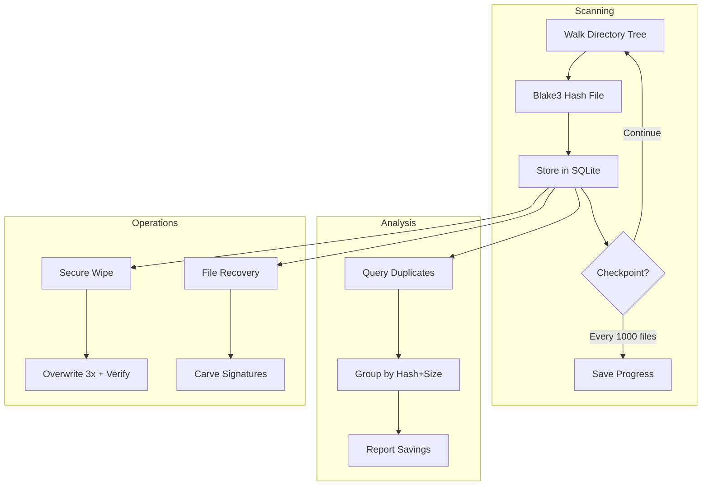

# Blake3 File Indexing (v3.2.0)

> High-performance deduplication and file analysis using Blake3 and SQLite.

---

## Table of Contents

- [Overview](#overview)
- [Architecture](#architecture)
- [SQLite Schema](#sqlite-schema)
- [Incremental Scanning](#incremental-scanning)
- [Duplicate Detection](#duplicate-detection)
- [Performance Targets](#performance-targets)

---

## Overview

The Storage Pro module (v3.2.0) provides:

- **Blake3 hashing**: Cryptographic-grade content addressing
- **Incremental indexing**: Resume interrupted scans
- **Duplicate detection**: Find identical files across drives
- **Secure wipe**: DoD 5220.22-M compliant file destruction
- **PhotoRec-style recovery**: Carve deleted files from raw disk



---

## Architecture

### Module Structure

```
src/core/storage/
├── mod.rs              # Public API
├── index.rs            # Blake3Index (SQLite wrapper)
├── scanner.rs          # Directory walker with resume
├── dedup.rs            # Duplicate detection algorithms
├── wipe.rs             # Secure deletion
└── recovery.rs         # File carving (PhotoRec-style)
```

### SQLite Backend (DT-03)

Unlike the main state file (JSON), the file index uses SQLite because:

- **Volume**: Millions of files, JSON would be unwieldy
- **Queries**: Complex SQL for duplicate detection, size filtering, path patterns
- **Transactions**: Atomic batch inserts, rollback on error
- **Resume**: Partial index updates without full rebuild

---

## SQLite Schema

```sql
-- Files table: one row per file
CREATE TABLE IF NOT EXISTS files (
    id INTEGER PRIMARY KEY,
    path TEXT UNIQUE NOT NULL,
    size INTEGER NOT NULL,
    modified INTEGER NOT NULL,      -- Unix timestamp
    blake3_hash BLOB NOT NULL,      -- 32 bytes
    indexed_at INTEGER NOT NULL,    -- Unix timestamp
    deleted INTEGER DEFAULT 0       -- Soft delete flag
);

-- Indexes for common queries
CREATE INDEX IF NOT EXISTS idx_hash ON files(blake3_hash);
CREATE INDEX IF NOT EXISTS idx_path ON files(path);
CREATE INDEX IF NOT EXISTS idx_size ON files(size);
CREATE INDEX IF NOT EXISTS idx_modified ON files(modified);

-- Index state: resume information
CREATE TABLE IF NOT EXISTS index_state (
    id INTEGER PRIMARY KEY CHECK (id = 1),
    last_scanned_path TEXT,
    total_files INTEGER DEFAULT 0,
    total_bytes INTEGER DEFAULT 0,
    started_at INTEGER,
    completed_at INTEGER,
    version INTEGER DEFAULT 1
);

-- Duplicate groups (materialized view, refreshed on demand)
CREATE TABLE IF NOT EXISTS duplicate_groups (
    blake3_hash BLOB NOT NULL,
    size INTEGER NOT NULL,
    paths TEXT NOT NULL,            -- JSON array of paths
    count INTEGER NOT NULL,
    wasted_bytes INTEGER NOT NULL   -- (count-1) * size
);
CREATE INDEX IF NOT EXISTS idx_dup_hash ON duplicate_groups(blake3_hash);
```

---

## Incremental Scanning

### Resume Logic

```rust
// src/core/storage/scanner.rs
pub struct IncrementalScanner {
    index: Blake3Index,
    checkpoint_interval: usize,
}

impl IncrementalScanner {
    pub async fn scan(&self, root: &Path, tx: Sender<AppMsg>) -> Result<ScanResult, StorageError> {
        let state = self.index.get_state().await?;
        let start_path = state.last_scanned_path
            .map(PathBuf::from)
            .unwrap_or_else(|| root.to_path_buf());

        let walker = WalkDir::new(root)
            .follow_links(false)
            .into_iter();

        let mut count = 0;
        let mut checkpoint_count = 0;

        for entry in walker.filter_entry(|e| e.path() >= start_path.as_path()) {
            let entry = entry?;
            if !entry.file_type().is_file() {
                continue;
            }

            let path = entry.path();
            let metadata = entry.metadata()?;

            // Check if already indexed and not modified
            if let Some(existing) = self.index.get_file(path).await? {
                if existing.modified == metadata.modified()?.duration_since(UNIX_EPOCH)?.as_secs() {
                    continue; // Skip unchanged file
                }
            }

            // Hash file
            let hash = self.hash_file(path).await?;

            // Insert/update
            self.index.insert_or_update(FileEntry {
                path: path.to_path_buf(),
                size: metadata.len(),
                modified: metadata.modified()?.duration_since(UNIX_EPOCH)?.as_secs(),
                blake3_hash: hash,
                indexed_at: chrono::Utc::now().timestamp(),
            }).await?;

            count += 1;
            checkpoint_count += 1;

            // Checkpoint every N files
            if checkpoint_count >= self.checkpoint_interval {
                self.index.save_checkpoint(path.to_string_lossy().to_string(), count).await?;
                checkpoint_count = 0;

                tx.send(AppMsg::StorageProgress {
                    files_scanned: count,
                    current_path: path.to_string_lossy().to_string(),
                }).await.ok();
            }
        }

        // Mark complete
        self.index.mark_complete(count).await?;

        Ok(ScanResult { files_scanned: count })
    }

    async fn hash_file(&self, path: &Path) -> Result<[u8; 32], StorageError> {
        let mut hasher = blake3::Hasher::new();
        let mut file = tokio::fs::File::open(path).await?;
        let mut buffer = [0u8; 65536];

        loop {
            let n = file.read(&mut buffer).await?;
            if n == 0 {
                break;
            }
            hasher.update(&buffer[..n]);
        }

        Ok(*hasher.finalize().as_bytes())
    }
}
```

---

## Duplicate Detection

### Query

```sql
-- Find duplicate files (same hash + size, different paths)
SELECT 
    blake3_hash,
    size,
    COUNT(*) as count,
    GROUP_CONCAT(path, '|') as paths,
    (COUNT(*) - 1) * size as wasted_bytes
FROM files
WHERE deleted = 0
GROUP BY blake3_hash, size
HAVING COUNT(*) > 1
ORDER BY wasted_bytes DESC;
```

### Rust Implementation

```rust
// src/core/storage/dedup.rs
pub async fn find_duplicates(&self) -> Result<Vec<DuplicateGroup>, StorageError> {
    let rows = sqlx::query_as::<_, DuplicateRow>(
        r#"
        SELECT blake3_hash, size, COUNT(*) as count, GROUP_CONCAT(path, '|') as paths
        FROM files
        WHERE deleted = 0
        GROUP BY blake3_hash, size
        HAVING COUNT(*) > 1
        ORDER BY (COUNT(*) - 1) * size DESC
        "#
    )
    .fetch_all(&self.pool).await?;

    rows.into_iter()
        .map(|row| {
            let paths: Vec<PathBuf> = row.paths.split('|')
                .map(PathBuf::from)
                .collect();

            Ok(DuplicateGroup {
                hash: row.blake3_hash.try_into().map_err(|_| StorageError::InvalidHash)?,
                size: row.size as u64,
                count: row.count as usize,
                paths,
                wasted_bytes: (row.count as u64 - 1) * row.size as u64,
            })
        })
        .collect()
}
```

---

## Performance Targets

| Metric | Target | Hardware |
|--------|--------|----------|
| Scan speed | 100,000 files/minute | NVMe SSD |
| Hash speed | 1 GB/second | NVMe SSD |
| Database inserts | 10,000 rows/second | NVMe SSD |
| Memory usage | < 256 MB | Any |
| Resume time | < 1 second | Any |

### Parallelization

```rust
use rayon::prelude::*;

// Parallel hashing for batch of files
let hashes: Vec<_> = file_batch
    .par_iter()
    .map(|path| {
        let mut hasher = blake3::Hasher::new();
        let content = std::fs::read(path)?;
        hasher.update(&content);
        Ok((path.clone(), *hasher.finalize().as_bytes()))
    })
    .collect::<Result<Vec<_>, _>>()?;
```

---

*Last updated: 2026-06-20 | Document version: 1.0*
