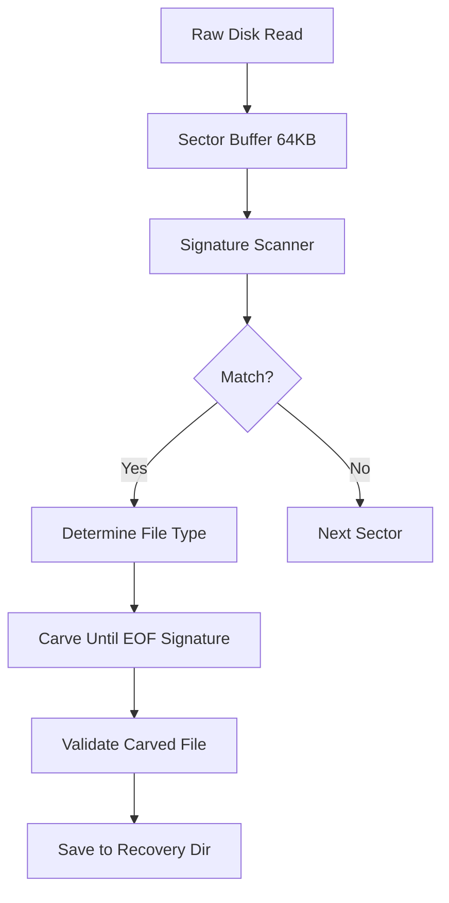

# File Recovery & Secure Wipe (v3.2.0)

> Data recovery and secure destruction capabilities.

---

## Table of Contents

- [PhotoRec-Style Recovery](#photorec-style-recovery)
- [Secure Wipe](#secure-wipe)
- [Implementation Notes](#implementation-notes)

---

## PhotoRec-Style Recovery

### Concept

Carve files from raw disk sectors by identifying file signatures (magic numbers), without relying on filesystem metadata.

### Supported Formats

| Format | Signature | Extension |
|--------|-----------|-----------|
| JPEG | `FF D8 FF` | .jpg, .jpeg |
| PNG | `89 50 4E 47` | .png |
| PDF | `25 50 44 46` | .pdf |
| ZIP | `50 4B 03 04` | .zip, .docx, .xlsx |
| MP3 | `FF FB` / `FF F3` / `FF F2` | .mp3 |
| MP4 | `66 74 79 70` (ftyp) | .mp4 |
| DOC/XLS | `D0 CF 11 E0` (OLE) | .doc, .xls |
| SQLite | `53 51 4C 69 74 65` | .db, .sqlite |

### Architecture



### Implementation Sketch

```rust
// src/core/storage/recovery.rs
pub struct FileCarver {
    signatures: Vec<FileSignature>,
    output_dir: PathBuf,
}

struct FileSignature {
    magic: Vec<u8>,
    extension: String,
    max_size: Option<u64>,
    eof_signature: Option<Vec<u8>>,
}

impl FileCarver {
    pub async fn carve_disk(&self, disk_path: &Path, tx: Sender<AppMsg>) -> Result<RecoveryResult, StorageError> {
        let mut disk = tokio::fs::File::open(disk_path).await?;
        let mut buffer = vec![0u8; 65536];
        let mut sector_offset = 0u64;
        let mut recovered = 0usize;

        loop {
            let n = disk.read(&mut buffer).await?;
            if n == 0 {
                break;
            }

            // Scan buffer for signatures
            for sig in &self.signatures {
                for pos in find_all(&buffer[..n], &sig.magic) {
                    let abs_offset = sector_offset + pos as u64;

                    match self.carve_file(&mut disk, abs_offset, sig).await {
                        Ok(path) => {
                            recovered += 1;
                            tx.send(AppMsg::RecoveryProgress {
                                files_recovered: recovered,
                                current_file: path.to_string_lossy().to_string(),
                            }).await.ok();
                        }
                        Err(e) => {
                            log::warn!("Failed to carve file at offset {}: {}", abs_offset, e);
                        }
                    }
                }
            }

            sector_offset += n as u64;
        }

        Ok(RecoveryResult { files_recovered: recovered })
    }
}
```

---

## Secure Wipe

### DoD 5220.22-M Standard

Overwrite pattern:
1. Pass 1: All zeros (`0x00`)
2. Pass 2: All ones (`0xFF`)
3. Pass 3: Random data
4. Verify: Read back and compare to last write

### Implementation

```rust
// src/core/storage/wipe.rs
pub struct SecureWiper;

impl SecureWiper {
    pub async fn wipe_file(path: &Path, method: WipeMethod) -> Result<(), StorageError> {
        let mut file = OpenOptions::new()
            .write(true)
            .open(path)
            .await?;

        let size = file.metadata().await?.len();

        match method {
            WipeMethod::Dod5220 => {
                // Pass 1: 0x00
                Self::write_pattern(&mut file, size, 0x00).await?;
                file.sync_all().await?;

                // Pass 2: 0xFF
                Self::write_pattern(&mut file, size, 0xFF).await?;
                file.sync_all().await?;

                // Pass 3: Random
                Self::write_random(&mut file, size).await?;
                file.sync_all().await?;

                // Verify
                Self::verify_random(&mut file, size).await?;
            }
            WipeMethod::Quick => {
                // Single pass random
                Self::write_random(&mut file, size).await?;
                file.sync_all().await?;
            }
        }

        // Truncate and delete
        file.set_len(0).await?;
        drop(file);
        tokio::fs::remove_file(path).await?;

        Ok(())
    }

    async fn write_pattern(file: &mut File, size: u64, pattern: u8) -> Result<(), StorageError> {
        let chunk = vec![pattern; 65536];
        let mut written = 0u64;

        while written < size {
            let to_write = std::cmp::min(chunk.len() as u64, size - written) as usize;
            file.write_all(&chunk[..to_write]).await?;
            written += to_write as u64;
        }

        Ok(())
    }

    async fn write_random(file: &mut File, size: u64) -> Result<(), StorageError> {
        let mut rng = rand::thread_rng();
        let mut written = 0u64;

        while written < size {
            let mut chunk = vec![0u8; 65536];
            let to_write = std::cmp::min(chunk.len() as u64, size - written) as usize;
            rng.fill_bytes(&mut chunk[..to_write]);
            file.write_all(&chunk[..to_write]).await?;
            written += to_write as u64;
        }

        Ok(())
    }
}
```

### Wipe Methods

| Method | Passes | Standard | Use Case |
|--------|--------|----------|----------|
| Quick | 1 (random) | None | Non-sensitive data, speed priority |
| DoD 5220 | 3 + verify | DoD 5220.22-M | Sensitive data, regulatory compliance |
| Gutmann | 35 | Gutmann method | Maximum security, very sensitive data |
| SSD Trim | 1 (ATA Secure Erase) | ATA | SSDs (avoids wear) |

---

## Implementation Notes

### Windows-Specific Considerations

- **Locked files**: Some files may be locked by the OS; use `MoveFileEx` with `MOVEFILE_DELAY_UNTIL_REBOOT` for deletion on next boot
- **System files**: Never wipe Windows system files; whitelist protected paths
- **SSD wear**: For SSDs, prefer ATA Secure Erase over multiple overwrites
- **UAC**: Secure wipe requires Administrator privileges

### Safety Checks

```rust
const PROTECTED_PATHS: &[&str] = &[
    r"C:\Windows",
    r"C:\Program Files",
    r"C:\ProgramData",
    r"C:\Users\*\AppData\Local\Microsoft",
];

pub fn is_path_safe(path: &Path) -> Result<(), StorageError> {
    let path_str = path.to_string_lossy();

    for protected in PROTECTED_PATHS {
        if path_str.starts_with(protected.replace("*", "").as_str()) {
            return Err(StorageError::ProtectedPath(path.to_path_buf()));
        }
    }

    Ok(())
}
```

---

*Last updated: 2026-06-20 | Document version: 1.0*
