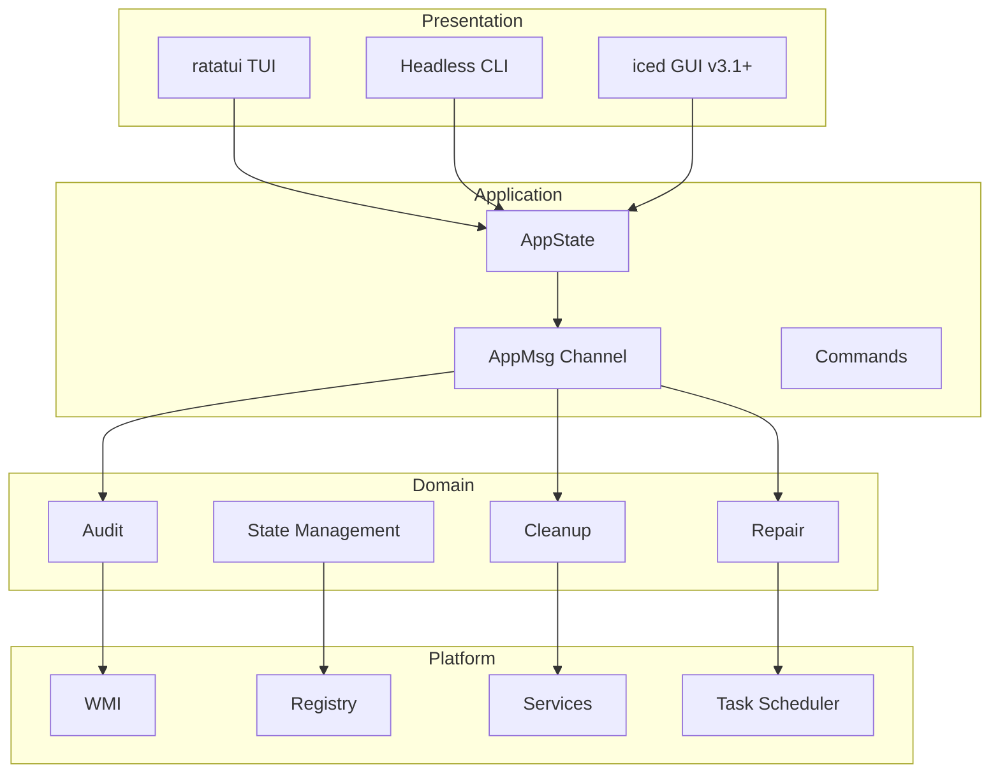

# 🗡️ Highlander Forge Blade

> **Professional Windows Maintenance Engine — Rust-powered, TUI-first, Enterprise-ready**

[](https://github.com/highlanderviralcenter-lab/highlander-forge-blade/actions)
[](https://crates.io/crates/highlander-forge-blade)
[](LICENSE)
[](https://blog.rust-lang.org/2024/05/02/Rust-1.78.0.html)
[](https://www.microsoft.com/windows)

---

## What is HFB?

**Highlander Forge Blade** is a next-generation Windows maintenance and optimization platform built in Rust. It bridges the gap between ad-hoc PowerShell scripts and bloated, closed-source "PC optimizers" by providing:

- 🎯 **A deterministic, auditable maintenance pipeline** — 5 phases from audit to post-reboot repair
- ⚡ **Zero-cost abstractions** — bare-metal performance via Rust's ownership model
- 🖥️ **Dual-mode operation** — interactive TUI for technicians, headless JSON for RMM/MSP integration
- 🔐 **Cryptographic integrity** — Ed25519-signed auto-updates, AES-256-GCM encrypted state
- 📊 **Fleet visibility** — SaaS dashboard for multi-machine management (v4.0+)

> *"There can be only one tool on the technician's USB stick."*

---

## Features

| Feature | Status | Version |
|---------|--------|---------|
| 5-phase maintenance cycle (Audit → Cleanup → Reboot → Repair) | ✅ Stable | v3.0.0 |
| Interactive TUI with real-time progress | ✅ Stable | v3.0.0 |
| Headless mode with JSON output | ✅ Stable | v3.0.0 |
| Auto-update with Ed25519 signature verification | ✅ Stable | v3.0.0 |
| State persistence with automatic migration | ✅ Stable | v3.0.0 |
| Dual-mode logging (human + JSON) | ✅ Stable | v3.0.0 |
| Windows Credential Manager key storage | ✅ Stable | v3.0.0 |
| GUI with Iced (wizard + dashboard) | 🚧 In Progress | v3.1.0 |
| Blake3 file indexing + deduplication | 📅 Planned | v3.2.0 |
| SaaS fleet dashboard | 📅 Planned | v4.0.0 |

---

## Quick Start

### Installation

```powershell
# Download latest release
Invoke-WebRequest -Uri "https://github.com/highlanderviralcenter-lab/highlander-forge-blade/releases/latest/download/hfb-x86_64-pc-windows-msvc.exe" -OutFile "hfb.exe"

# Verify signature
Get-AuthenticodeSignature -FilePath ".\hfb.exe"

# Run
.\hfb.exe
```

### Interactive Mode (TUI)

```powershell
# Launch interactive maintenance
hfb

# Or with specific phase
hfb --auto-phase 1  # Audit only
```

### Headless Mode (MSP/RMM)

```powershell
# Full maintenance, JSON output
hfb --auto-phase 0 --format=json --output="C:\Temp
esult.json"

# Simulation (preview without changes)
hfb --what-if
```

---

## Architecture



---

## Documentation

| Document | Description |
|----------|-------------|
| [00-product/vision.md](00-product/vision.md) | Product vision and principles |
| [00-product/use-cases.md](00-product/use-cases.md) | Complete use case catalog |
| [00-product/requirements.md](00-product/requirements.md) | Functional & non-functional requirements |
| [00-product/roadmap.md](00-product/roadmap.md) | Milestone timeline |
| [01-user/getting-started.md](01-user/getting-started.md) | First-time user guide |
| [01-user/operation-modes.md](01-user/operation-modes.md) | TUI, headless, simulation reference |
| [01-user/reports.md](01-user/reports.md) | Output formats and customization |
| [02-engineering/workflow.md](02-engineering/workflow.md) | Development workflow |
| [02-engineering/state-machine.md](02-engineering/state-machine.md) | State persistence and recovery |
| [02-engineering/function-points.md](02-engineering/function-points.md) | Sizing analysis |
| [02-engineering/risks.md](02-engineering/risks.md) | Risk register |
| [03-architecture/architecture.md](03-architecture/architecture.md) | System architecture |
| [03-architecture/runtime.md](03-architecture/runtime.md) | Async runtime and MPSC channel |
| [03-architecture/ui.md](03-architecture/ui.md) | UI layer design |
| [03-architecture/platform.md](03-architecture/platform.md) | Windows platform abstractions |
| [04-security/security.md](04-security/security.md) | Security architecture |
| [04-security/updates.md](04-security/updates.md) | Auto-update system |
| [04-security/credential-manager.md](04-security/credential-manager.md) | Key storage |
| [05-development/versioning.md](05-development/versioning.md) | Versioning & releases |
| [05-development/branching.md](05-development/branching.md) | Git branching strategy |
| [05-development/contributing.md](05-development/contributing.md) | Contribution guide |
| [06-future/indexing.md](06-future/indexing.md) | Blake3 file indexing |
| [06-future/recovery.md](06-future/recovery.md) | File recovery & secure wipe |
| [06-future/api.md](06-future/api.md) | SaaS API & portal |
| [07-decisions/](07-decisions/) | Architecture Decision Records (ADRs) |

---

## Safety & Security

- 🔒 **AES-256-GCM** state encryption via Windows Credential Manager
- ✅ **Ed25519** signature verification for all updates
- 🛡️ **No hardcoded secrets** — all keys generated at runtime or compile-time
- 📝 **Structured audit logs** — every operation timestamped and logged
- 🧪 **Mock-based testing** — CI runs on Linux with full test coverage

---

## Performance

| Metric | Target | Measured |
|--------|--------|----------|
| Full audit (Phase 1) | < 60s | — |
| Cleanup (Phase 3) | > 1 GB/min | — |
| TUI render | 60 FPS | — |
| Binary size (stripped) | < 50 MB | — |
| Memory footprint | < 128 MB | — |

---

## Contributing

We welcome contributions! Please see our [Contributing Guide](05-development/contributing.md) for details.

- 🐛 [Report bugs](https://github.com/highlanderviralcenter-lab/highlander-forge-blade/issues)
- 💡 [Request features](https://github.com/highlanderviralcenter-lab/highlander-forge-blade/issues)
- 🔧 [Submit PRs](https://github.com/highlanderviralcenter-lab/highlander-forge-blade/pulls)

---

## License

This project is dual-licensed under:

- **MIT License** — for open source use
- **Proprietary License** — for commercial/enterprise use

See [LICENSE](LICENSE) for details.

---

## Acknowledgments

Built with:
- [Rust](https://www.rust-lang.org/) — Systems programming with safety
- [Tokio](https://tokio.rs/) — Async runtime
- [ratatui](https://ratatui.rs/) — Terminal UI framework
- [iced](https://iced.rs/) — GUI framework (v3.1+)
- [Axum](https://github.com/tokio-rs/axum) — Web framework (v4.0+)

---

<p align="center">
  <strong>🗡️ Highlander Forge Blade</strong><br>
  <em>Professional Windows Maintenance</em><br>
  <a href="https://github.com/highlanderviralcenter-lab/highlander-forge-blade">GitHub</a> •
  <a href="https://github.com/highlanderviralcenter-lab/highlander-forge-blade/tree/main/docs">Documentation</a> •
  <a href="">Discord</a>
</p>
